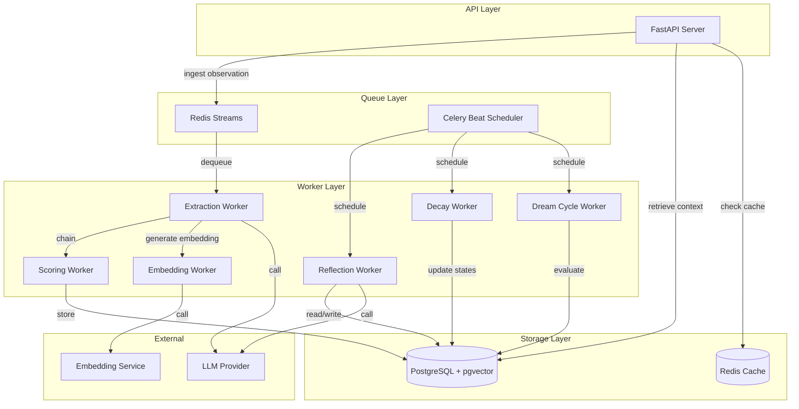
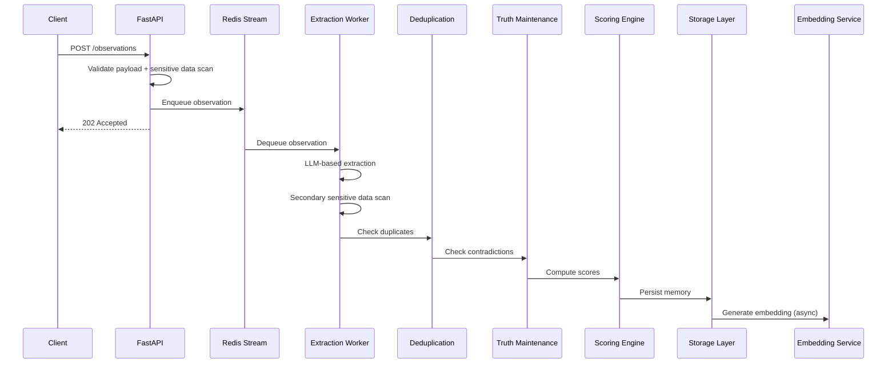
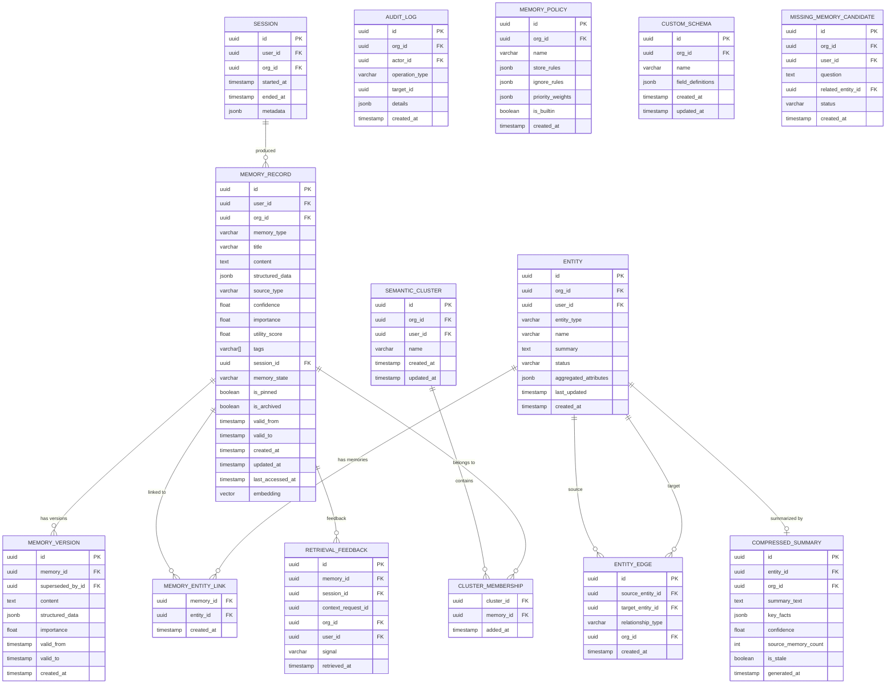

# Design Document: contexta Core Engine

## Overview

contexta Core Engine is a Python-based memory intelligence pipeline for AI agents. It ingests conversation observations, extracts structured memories, resolves entities and contradictions, scores and stores memories in a hybrid index (PostgreSQL + pgvector), and retrieves contextually relevant intelligence on demand. The system operates as an event-driven pipeline with synchronous API endpoints for ingestion and retrieval, and asynchronous background workers for extraction, scoring, reflection, decay, and self-improvement cycles.

### Key Design Decisions

1. **PostgreSQL + pgvector** for unified relational + vector storage — avoids operational complexity of separate vector databases while supporting hybrid queries (SQL WHERE + vector similarity) in a single transaction.
2. **Redis** for job queuing (Redis Streams), session caching (Hot_Context), and pub/sub for real-time invalidation signals.
3. **Celery with Redis broker** for background worker orchestration — provides task routing, retries, periodic scheduling (beat), and priority queues.
4. **HNSW indexing** in pgvector for approximate nearest neighbor search with high recall and sub-200ms latency at 100K records per tenant.
5. **Shared-table multi-tenancy** with `organization_id` column on all tables and enforced at the repository layer — simpler operations than schema-per-tenant while maintaining strict isolation.
6. **Event-driven pipeline** where observation ingestion enqueues work, and downstream processors (extraction, dedup, contradiction, scoring, storage) execute as chained Celery tasks.

### Technology Stack

| Layer | Technology |
|-------|-----------|
| Language | Python 3.11+ |
| API Framework | FastAPI |
| Database | PostgreSQL 16 + pgvector extension |
| Cache / Queue Broker | Redis 7+ |
| Task Queue | Celery 5.4+ with Redis broker |
| ORM / Query | SQLAlchemy 2.0 + asyncpg |
| Embedding | OpenAI text-embedding-3-small (configurable) |
| Testing | pytest + Hypothesis (property-based) |
| Migrations | Alembic |


## Architecture

### High-Level Architecture



### Pipeline Flow



### Module Structure

```
contexta/
├── api/                    # FastAPI routes and middleware
│   ├── routes/
│   │   ├── observations.py
│   │   ├── retrieval.py
│   │   ├── memories.py
│   │   ├── sessions.py
│   │   └── schemas.py
│   ├── middleware/
│   │   ├── auth.py
│   │   └── tenant.py
│   └── deps.py
├── core/                   # Domain logic
│   ├── extraction/
│   │   ├── worker.py
│   │   ├── classifier.py
│   │   └── sensitive_filter.py
│   ├── entities/
│   │   ├── resolver.py
│   │   └── state_manager.py
│   ├── truth/
│   │   └── maintenance.py
│   ├── scoring/
│   │   ├── engine.py
│   │   └── importance.py
│   ├── retrieval/
│   │   ├── engine.py
│   │   ├── reranker.py
│   │   └── feedback.py
│   ├── context/
│   │   ├── builder.py
│   │   └── planner.py
│   ├── policy/
│   │   ├── engine.py
│   │   └── templates.py
│   ├── schema_registry/
│   │   └── registry.py
│   ├── compression/
│   │   └── engine.py
│   ├── clustering/
│   │   └── engine.py
│   ├── decay/
│   │   └── engine.py
│   ├── reflection/
│   │   └── engine.py
│   └── dream/
│       └── engine.py
├── models/                 # SQLAlchemy models
│   ├── memory.py
│   ├── entity.py
│   ├── session.py
│   ├── audit.py
│   ├── policy.py
│   ├── schema.py
│   ├── cluster.py
│   └── feedback.py
├── repositories/           # Data access layer (tenant-scoped)
│   ├── base.py
│   ├── memory_repo.py
│   ├── entity_repo.py
│   ├── session_repo.py
│   └── audit_repo.py
├── services/               # Orchestration services
│   ├── embedding.py
│   └── llm.py
├── workers/                # Celery task definitions
│   ├── celery_app.py
│   ├── extraction_tasks.py
│   ├── scoring_tasks.py
│   ├── reflection_tasks.py
│   ├── decay_tasks.py
│   └── dream_tasks.py
├── config/                 # Configuration
│   └── settings.py
└── migrations/             # Alembic migrations
```

## Components and Interfaces

### 1. Observation Engine (API Layer)

**Responsibility:** Accept, validate, filter, and enqueue conversation payloads.

```python
class ObservationEngine:
    async def ingest(self, payload: ObservationPayload) -> IngestResponse:
        """Validate, scan for sensitive data, enqueue for extraction."""
        ...

    async def ingest_batch(self, payloads: list[ObservationPayload]) -> BatchIngestResponse:
        """Batch submission of multiple observations."""
        ...

    def _validate_payload(self, payload: ObservationPayload) -> ValidationResult:
        """Check required fields, size limits (1MB max)."""
        ...

    def _scan_sensitive_data(self, content: str) -> tuple[str, list[RedactionEvent]]:
        """Detect and redact passwords, tokens, PII. Returns cleaned content."""
        ...
```

### 2. Extraction Worker

**Responsibility:** Process observations to extract typed, structured memories.

```python
class ExtractionWorker:
    async def process(self, observation: Observation, policy: MemoryPolicy | None) -> list[ExtractedMemory]:
        """LLM-based extraction of structured memories from observation."""
        ...

    def _classify_memory(self, raw: dict) -> MemoryType:
        """Assign memory_type from defined set."""
        ...

    def _assign_source_type(self, observation: Observation) -> SourceType:
        """Determine source_type based on observation origin."""
        ...

    def _secondary_sensitive_scan(self, memory: ExtractedMemory) -> bool:
        """Final check that no sensitive data leaked through extraction."""
        ...
```

### 3. Entity Resolver

**Responsibility:** Link memories to unified entities in the knowledge graph.

```python
class EntityResolver:
    async def resolve(self, memory: ExtractedMemory, tenant_id: str) -> EntityResolution:
        """Match memory to existing entity or create new one."""
        ...

    async def _find_match(self, memory: ExtractedMemory, candidates: list[Entity]) -> Entity | None:
        """Semantic + name matching with 0.8 confidence threshold."""
        ...

    async def _create_entity(self, memory: ExtractedMemory) -> Entity:
        """Create new entity node with typed edges."""
        ...

    async def _create_edge(self, source: Entity, target: Entity, rel_type: RelationType) -> Edge:
        """Create typed relationship edge."""
        ...
```

### 4. Truth Maintenance Engine

**Responsibility:** Detect and resolve contradictions between memories.

```python
class TruthMaintenanceEngine:
    async def check_and_resolve(self, new_memory: ExtractedMemory, entity: Entity) -> ContradictionResult:
        """Compare new memory against existing for same entity/type."""
        ...

    async def _detect_contradiction(self, new: ExtractedMemory, existing: MemoryRecord) -> bool:
        """LLM-based contradiction detection."""
        ...

    async def _supersede(self, old: MemoryRecord, new: ExtractedMemory) -> SupersessionEvent:
        """Invalidate old memory, create SUPERSEDED_BY link, preserve version."""
        ...
```

### 5. Memory Scoring Engine

**Responsibility:** Compute importance, confidence, freshness, and utility scores.

```python
class MemoryScoringEngine:
    def compute_importance(self, memory: ExtractedMemory, framework: ImportanceFramework) -> float:
        """Delegate to ImportanceFramework for type-based + modifier scoring."""
        ...

    def compute_confidence(self, source_type: SourceType) -> float:
        """Static mapping: user_explicit=1.0, tool_output=0.8, agent_inference=0.6."""
        ...

    def compute_freshness(self, created_at: datetime, now: datetime) -> float:
        """Time-decay function based on memory age."""
        ...

    def compute_utility(self, retrieval_count: int, usage_count: int) -> float:
        """Ratio of positive usage signals to total retrievals."""
        ...
```

### 6. Importance Framework

**Responsibility:** Rule-based importance scoring with contextual modifiers.

```python
class ImportanceFramework:
    BASE_SCORES: dict[MemoryType, float] = {
        MemoryType.PROJECT: 0.9,
        MemoryType.GOAL: 0.85,
        MemoryType.PREFERENCE: 0.75,
        MemoryType.SKILL: 0.7,
        MemoryType.RELATIONSHIP: 0.7,
        MemoryType.FACT: 0.6,
        MemoryType.EPISODIC: 0.55,
        MemoryType.EVENT: 0.5,
        MemoryType.PATTERN: 0.5,
        MemoryType.CONTACT: 0.6,
        MemoryType.CUSTOM: 0.5,
    }

    def compute(self, memory: ExtractedMemory, signals: ImportanceSignals) -> float:
        """Apply base score + modifiers, clamp to [0.0, 1.0]."""
        ...

    def _apply_repetition_modifier(self, base: float, mention_count: int) -> float:
        """+0.1 max when mentioned in 3+ sessions."""
        ...

    def _apply_recency_modifier(self, base: float, last_referenced: datetime) -> float:
        """+0.05 max when referenced within 7 days."""
        ...

    def _apply_emphasis_modifier(self, base: float, has_emphasis: bool) -> float:
        """+0.15 when user explicitly says 'remember this'."""
        ...

    def _apply_decision_impact_modifier(self, base: float, impacts_decisions: bool) -> float:
        """+0.1 max when memory references goals/deadlines/dependencies."""
        ...

    def _apply_utility_modifier(self, base: float, utility_ratio: float) -> float:
        """±0.1 based on measured usage ratio from feedback engine."""
        ...

    def is_low_value(self, content: str) -> bool:
        """Reject greetings, small talk, filler content."""
        ...
```

### 7. Retrieval Engine

**Responsibility:** Hybrid search combining semantic, keyword, graph, and ranking.

```python
class RetrievalEngine:
    WEIGHTS = {
        "semantic": 0.40,
        "graph": 0.25,
        "importance": 0.20,
        "recency": 0.10,
        "keyword": 0.05,
    }

    async def retrieve(self, query: RetrievalQuery, tenant: TenantContext) -> RetrievalResult:
        """Execute hybrid retrieval with weighted combination and reranking."""
        ...

    async def _semantic_search(self, embedding: list[float], tenant: TenantContext, limit: int) -> list[ScoredMemory]:
        """pgvector cosine similarity search."""
        ...

    async def _keyword_search(self, terms: list[str], tenant: TenantContext, limit: int) -> list[ScoredMemory]:
        """Full-text search on title, content, tags."""
        ...

    async def _graph_expand(self, entities: list[str], depth: int, tenant: TenantContext) -> list[ScoredMemory]:
        """BFS expansion through entity graph within hop depth."""
        ...

    async def _combine_and_rank(self, results: dict[str, list[ScoredMemory]]) -> list[ScoredMemory]:
        """Weighted combination of all search signals."""
        ...

    async def _rerank(self, candidates: list[ScoredMemory], query: str) -> list[ScoredMemory]:
        """LLM-based reranking for final ordering."""
        ...
```

### 8. Context Builder

**Responsibility:** Assemble retrieved memories into structured agent context.

```python
class ContextBuilder:
    async def build(self, request: ContextRequest, tenant: TenantContext) -> ContextResponse:
        """Assemble structured context with caching."""
        ...

    async def _check_cache(self, session_id: str, tenant: TenantContext) -> ContextResponse | None:
        """Check Redis Hot_Context cache."""
        ...

    async def _assemble_sections(self, memories: list[ScoredMemory], config: ContextConfig) -> ContextSections:
        """Organize memories into user_profile, projects, preferences, goals, events, relevant."""
        ...

    async def _cache_result(self, session_id: str, result: ContextResponse) -> None:
        """Store in Redis with TTL."""
        ...
```

### 9. Context Planner

**Responsibility:** Allocate token budget across memory categories.

```python
class ContextPlanner:
    DEFAULT_WEIGHTS = {
        "projects": 0.35,
        "goals": 0.20,
        "facts": 0.15,
        "episodic": 0.15,
        "preferences": 0.10,
        "relationships": 0.05,
    }

    def plan(self, budget: int, memories: dict[str, list[ScoredMemory]], 
             custom_weights: dict[str, float] | None = None) -> TokenAllocation:
        """Allocate token budget, redistribute unused, prefer summaries."""
        ...

    def _redistribute_unused(self, allocation: TokenAllocation) -> TokenAllocation:
        """Proportionally redistribute unused category tokens."""
        ...
```

### 10. Policy Engine

**Responsibility:** Domain-specific extraction behavior configuration.

```python
class PolicyEngine:
    async def register_policy(self, policy: MemoryPolicyDefinition, tenant: TenantContext) -> PolicyId:
        """Register a named policy profile."""
        ...

    async def get_policy(self, name: str, tenant: TenantContext) -> MemoryPolicy:
        """Retrieve policy by name, fall back to default."""
        ...

    def apply_policy(self, memories: list[ExtractedMemory], policy: MemoryPolicy) -> list[ExtractedMemory]:
        """Filter memories based on store/ignore rules, apply priority overrides."""
        ...

    def get_builtin_templates(self) -> dict[str, MemoryPolicy]:
        """Return coding-agent, crm-agent, tutor-agent templates."""
        ...
```

### 11. Schema Registry

**Responsibility:** Custom structured memory schema management.

```python
class SchemaRegistry:
    async def register(self, schema: CustomSchemaDefinition, tenant: TenantContext) -> SchemaId:
        """Validate and register a custom schema."""
        ...

    async def validate_schema(self, schema: CustomSchemaDefinition) -> ValidationResult:
        """Check no duplicate fields, valid types, required fields specified."""
        ...

    async def extract_with_schema(self, content: str, schema: CustomSchema) -> StructuredData | None:
        """Extract data into schema-defined fields, validate against constraints."""
        ...
```

### 12. Memory Compression Engine

**Responsibility:** Generate compressed summaries from memory clusters.

```python
class MemoryCompressionEngine:
    async def compress(self, entity: Entity, memories: list[MemoryRecord]) -> CompressedSummary:
        """Generate distilled summary from 20+ memories for an entity."""
        ...

    async def mark_stale(self, summary_id: str) -> None:
        """Mark summary as stale when new memories arrive."""
        ...

    async def regenerate(self, summary: CompressedSummary) -> CompressedSummary:
        """Regenerate stale summary incorporating new memories."""
        ...
```

### 13. Semantic Cluster Engine

**Responsibility:** Group related memories into named semantic clusters.

```python
class SemanticClusterEngine:
    async def identify_clusters(self, tenant: TenantContext) -> list[SemanticCluster]:
        """Find groups of 3+ related memories/entities via embedding proximity + graph."""
        ...

    async def add_to_cluster(self, memory: MemoryRecord, cluster: SemanticCluster) -> None:
        """Add semantically related memory to existing cluster."""
        ...

    async def remove_from_cluster(self, memory_id: str, cluster: SemanticCluster) -> None:
        """Remove invalidated/archived memory, re-evaluate cluster validity."""
        ...

    async def name_cluster(self, members: list[MemoryRecord]) -> str:
        """LLM-generated descriptive name for cluster."""
        ...
```

### 14. Decay Engine

**Responsibility:** Manage memory lifecycle state transitions.

```python
class DecayEngine:
    STATE_TRANSITIONS = {
        (MemoryState.ACTIVE, 30): MemoryState.WARM,
        (MemoryState.WARM, 90): MemoryState.COLD,
        (MemoryState.COLD, 180): MemoryState.ARCHIVED,
    }

    async def run_decay_cycle(self, tenant: TenantContext) -> DecayCycleResult:
        """Evaluate all non-pinned memories for state transitions."""
        ...

    async def reactivate(self, memory_id: str) -> None:
        """Transition accessed memory back to active state."""
        ...
```

### 15. Reflection Engine

**Responsibility:** Autonomous periodic memory maintenance.

```python
class ReflectionEngine:
    async def run_cycle(self, tenant: TenantContext) -> ReflectionCycleResult:
        """Execute full reflection: dedup, contradictions, dormancy, snapshots, models."""
        ...

    async def _merge_duplicates(self, tenant: TenantContext) -> list[MergeEvent]:
        """Find and merge 3+ memories containing same fact."""
        ...

    async def _detect_dormant_goals(self, tenant: TenantContext) -> list[DormancyEvent]:
        """Mark goals not referenced in 180 days as dormant."""
        ...

    async def _generate_project_snapshots(self, tenant: TenantContext) -> list[ProjectSnapshot]:
        """Generate snapshots for active project entities."""
        ...

    async def _generate_user_models(self, tenant: TenantContext) -> list[UserModel]:
        """Synthesize user profiles from aggregated memories."""
        ...
```

### 16. Dream Cycle Engine

**Responsibility:** Self-evaluation and knowledge gap identification.

```python
class DreamCycleEngine:
    async def run_cycle(self, tenant: TenantContext) -> DreamCycleResult:
        """Generate synthetic questions, evaluate retrieval, identify gaps."""
        ...

    async def _generate_questions(self, entities: list[Entity]) -> list[SyntheticQuestion]:
        """LLM-generated questions based on known entities and relationships."""
        ...

    async def _evaluate_retrieval(self, question: SyntheticQuestion) -> EvaluationResult:
        """Attempt retrieval and assess answer quality."""
        ...

    async def _identify_gap(self, question: SyntheticQuestion, result: EvaluationResult) -> MissingMemoryCandidate | None:
        """Generate missing memory candidate if retrieval fails."""
        ...
```

### 17. Retrieval Feedback Engine

**Responsibility:** Track memory usage signals for measured utility scoring.

```python
class RetrievalFeedbackEngine:
    async def record_retrieval(self, memory_ids: list[str], context_request_id: str, session_id: str) -> None:
        """Record that memories were retrieved for a context request."""
        ...

    async def record_usage(self, memory_id: str, signal: UsageSignal) -> None:
        """Record positive (used) or negative (ignored) signal."""
        ...

    def compute_utility_ratio(self, memory_id: str) -> float:
        """Ratio of positive signals to total retrievals."""
        ...

    async def apply_importance_adjustments(self) -> list[AdjustmentEvent]:
        """Reduce importance for consistently ignored, boost for consistently used."""
        ...
```

### 18. Entity State Manager

**Responsibility:** Maintain rich state for knowledge graph entities.

```python
class EntityStateManager:
    async def update_state(self, entity_id: str, new_memory: MemoryRecord) -> EntityState:
        """Update entity summary, timestamp, and aggregated attributes."""
        ...

    async def transition_inactive(self, days_threshold: int = 90) -> list[Entity]:
        """Mark entities without observations for 90 days as inactive."""
        ...

    async def reactivate(self, entity_id: str) -> None:
        """Transition inactive entity back to active on new observation."""
        ...

    async def get_state(self, entity_id: str, tenant: TenantContext) -> EntityState:
        """Return full entity state with summary, status, aggregated attributes."""
        ...
```

## Data Models

### Core Tables



### Key Data Types

```python
from enum import Enum
from dataclasses import dataclass
from datetime import datetime
from uuid import UUID

class MemoryType(str, Enum):
    FACT = "fact"
    PREFERENCE = "preference"
    GOAL = "goal"
    PROJECT = "project"
    SKILL = "skill"
    RELATIONSHIP = "relationship"
    EVENT = "event"
    EPISODIC = "episodic"
    PATTERN = "pattern"
    CONTACT = "contact"
    CUSTOM = "custom"

class SourceType(str, Enum):
    USER_EXPLICIT = "user_explicit"
    AGENT_INFERENCE = "agent_inference"
    TOOL_OUTPUT = "tool_output"
    IMPORTED_FILE = "imported_file"
    API = "api"

class MemoryState(str, Enum):
    ACTIVE = "active"
    WARM = "warm"
    COLD = "cold"
    ARCHIVED = "archived"

class EntityType(str, Enum):
    PROJECT = "project"
    PERSON = "person"
    COMPANY = "company"
    TECHNOLOGY = "technology"
    PREFERENCE = "preference"
    GOAL = "goal"
    SKILL = "skill"
    TOPIC = "topic"

class RelationType(str, Enum):
    USES = "uses"
    WORKS_ON = "works_on"
    LIKES = "likes"
    DEPENDS_ON = "depends_on"
    OWNS = "owns"
    SUPERSEDED_BY = "superseded_by"
    RELATED_TO = "related_to"

class UsageSignal(str, Enum):
    USED = "used"
    IGNORED = "ignored"

@dataclass
class ObservationPayload:
    user_id: UUID
    organization_id: UUID
    session_id: UUID
    messages: list[dict]  # user/assistant/tool messages
    metadata: dict | None = None
    policy: str | None = None  # named policy to apply

@dataclass
class ExtractedMemory:
    memory_type: MemoryType
    source_type: SourceType
    title: str
    content: str
    structured_data: dict | None
    tags: list[str]
    entities: list[str]  # entity references for resolution
    has_emphasis: bool
    impacts_decisions: bool

@dataclass
class ImportanceSignals:
    mention_count: int
    last_referenced: datetime | None
    has_emphasis: bool
    impacts_decisions: bool
    utility_ratio: float | None

@dataclass
class TokenAllocation:
    total_budget: int
    allocations: dict[str, int]  # category -> token count
    actual_usage: dict[str, int]  # category -> tokens used
```

### Indexing Strategy

| Table | Index | Type | Purpose |
|-------|-------|------|---------|
| memory_record | embedding | HNSW (cosine) | Semantic similarity search |
| memory_record | (org_id, user_id, memory_type) | B-tree | Tenant-scoped type filtering |
| memory_record | (org_id, user_id, memory_state) | B-tree | Decay engine queries |
| memory_record | content, title, tags | GIN (tsvector) | Full-text keyword search |
| memory_record | (org_id, valid_to) | B-tree partial (valid_to IS NULL) | Current truth queries |
| entity | (org_id, user_id, entity_type) | B-tree | Entity lookups |
| entity_edge | (source_entity_id) | B-tree | Graph traversal |
| entity_edge | (target_entity_id) | B-tree | Reverse graph traversal |
| retrieval_feedback | (memory_id, signal) | B-tree | Utility computation |
| audit_log | (org_id, created_at) | B-tree | Audit queries |


## Correctness Properties

*A property is a characteristic or behavior that should hold true across all valid executions of a system — essentially, a formal statement about what the system should do. Properties serve as the bridge between human-readable specifications and machine-verifiable correctness guarantees.*

### Property 1: Observation payload validation boundary

*For any* observation payload, if its serialized size exceeds 1MB the system SHALL reject it with a size error, and if its size is within 1MB and all required fields are present the system SHALL accept it.

**Validates: Requirements 1.3, 1.4**

### Property 2: Observation payload field validation

*For any* observation payload missing one or more required fields (user_id, organization_id, session_id, messages), the system SHALL reject it with a validation error that specifies exactly which fields are invalid.

**Validates: Requirements 1.4, 1.5**

### Property 3: Sensitive data redaction completeness

*For any* text content containing embedded sensitive data patterns (passwords, OTPs, payment card numbers, API secrets, tokens, session cookies), after redaction the output text SHALL NOT contain the original sensitive value.

**Validates: Requirements 3.1, 3.2, 3.3, 3.4**

### Property 4: Extracted memory type invariant

*For any* extracted memory, its memory_type SHALL be a member of the defined MemoryType enum and its source_type SHALL be a member of the defined SourceType enum, and its title SHALL be a non-empty string.

**Validates: Requirements 2.2, 2.3, 2.4**

### Property 5: Entity resolution threshold

*For any* entity match with confidence score above 0.8, the memory SHALL be linked to the existing entity. *For any* entity match with confidence score at or below 0.8, a new entity SHALL be created instead.

**Validates: Requirements 4.2, 4.3**

### Property 6: Entity timestamp monotonicity

*For any* entity resolution event, the entity's last_updated timestamp SHALL be greater than or equal to the observation timestamp that triggered the resolution.

**Validates: Requirements 4.6, 23.3**

### Property 7: Supersession invariants

*For any* supersession event: (a) the old memory's valid_to SHALL be non-null, (b) a SUPERSEDED_BY edge SHALL exist from old to new memory, and (c) a memory_version record SHALL preserve the old content.

**Validates: Requirements 5.2, 5.3, 5.4**

### Property 8: Current vs historical truth partition

*For any* memory in the store, it is either current truth (valid_to is null) or historical truth (valid_to is set) — these two sets are mutually exclusive and exhaustive for all stored memories.

**Validates: Requirements 5.5**

### Property 9: Importance score clamping

*For any* memory with any combination of base type score and modifiers (repetition, recency, emphasis, decision-impact, utility), the final computed importance score SHALL be in the range [0.0, 1.0].

**Validates: Requirements 6.1, 17.7**

### Property 10: Importance base score mapping

*For any* memory_type, the ImportanceFramework SHALL assign the defined base score: project=0.9, goal=0.85, preference=0.75, skill=0.7, relationship=0.7, fact=0.6, episodic=0.55, event=0.5, pattern=0.5, contact=0.6, custom=0.5.

**Validates: Requirements 17.1**

### Property 11: Importance modifier bounds

*For any* memory, each individual modifier SHALL be bounded: repetition in [0, 0.1], recency in [0, 0.05], emphasis exactly 0.15 when present, decision-impact in [0, 0.1], and utility in [-0.1, 0.1].

**Validates: Requirements 17.2, 17.3, 17.4, 17.5, 17.6**

### Property 12: Low-value content rejection

*For any* content that matches low-value patterns (greetings, small talk, filler), the ImportanceFramework SHALL classify it as low-value and reject it from storage.

**Validates: Requirements 17.8**

### Property 13: Confidence score determinism

*For any* source_type, the confidence score SHALL be deterministically mapped: user_explicit → 1.0, tool_output → 0.8, agent_inference → 0.6, imported_file → 0.7, api → 0.7.

**Validates: Requirements 6.2**

### Property 14: Freshness monotonic decay

*For any* two memories where memory A is older than memory B, freshness(A) SHALL be less than or equal to freshness(B) — freshness decreases monotonically with age.

**Validates: Requirements 6.3**

### Property 15: Utility ratio computation

*For any* memory with retrieval_count > 0, the utility score SHALL equal usage_count / retrieval_count and be bounded in [0.0, 1.0]. Recording a positive signal SHALL not decrease utility. Recording an ignored signal SHALL not increase utility.

**Validates: Requirements 6.4, 6.5, 22.2, 22.3, 22.4**

### Property 16: Tenant isolation

*For any* database query executed on behalf of tenant A, all returned records (memories, entities, edges, sessions, audit logs, feedback, schemas, clusters) SHALL have organization_id equal to A. *For any* write operation where the authenticated org_id does not match the target org_id, the operation SHALL be rejected.

**Validates: Requirements 7.3, 8.7, 14.1, 14.2, 14.3, 14.4, 16.5, 19.7, 22.8, 25.8**

### Property 17: Retrieval weighted score computation

*For any* set of component scores (semantic, graph, importance, recency, keyword), the combined retrieval score SHALL equal: 0.40 * semantic + 0.25 * graph + 0.20 * importance + 0.10 * recency + 0.05 * keyword.

**Validates: Requirements 8.4**

### Property 18: Graph expansion depth bound

*For any* graph expansion with configured depth N, all returned entities SHALL be reachable from the query entity within N hops.

**Validates: Requirements 8.3**

### Property 19: Context excludes archived and invalidated memories

*For any* context response, no included memory SHALL have is_archived=true or valid_to set (invalidated). Archived memories SHALL only appear when explicitly requested.

**Validates: Requirements 9.4, 12.3, 20.8**

### Property 20: Context section ordering

*For any* section in a context response, the memories within that section SHALL be ordered by combined relevance score in descending order.

**Validates: Requirements 9.5**

### Property 21: Deduplication threshold behavior

*For any* pair of memories with semantic similarity > 0.95, the deduplication engine SHALL classify the new memory as a duplicate and discard it. *For any* pair with similarity in [0.85, 0.95], the engine SHALL merge new information into the existing memory.

**Validates: Requirements 10.2, 10.3, 10.4**

### Property 22: Deduplication scope invariant

*For any* deduplication comparison, both memories SHALL share the same user_id, organization_id, and memory_type. The engine SHALL never compare memories across different tenants, users, or types.

**Validates: Requirements 10.5**

### Property 23: Timeline chronological ordering

*For any* timeline response from contexta.timeline(userId), events SHALL be ordered by timestamp in ascending chronological order.

**Validates: Requirements 11.5**

### Property 24: Explain completeness for superseded memories

*For any* memory with valid_to set (superseded), the explain response SHALL include non-empty supersession history containing previous values and timestamps.

**Validates: Requirements 11.4**

### Property 25: Lifecycle operation round-trip

*For any* memory, pin followed by unpin SHALL result in is_pinned=false. Archive followed by restore SHALL result in is_archived=false. These operations are inverses.

**Validates: Requirements 12.1, 12.2, 12.3, 12.4**

### Property 26: Delete removes all traces

*For any* deleted memory_id, querying by that ID SHALL return no results from any table (memory_record, memory_entity_link, memory_version, cluster_membership, retrieval_feedback, embeddings).

**Validates: Requirements 12.5**

### Property 27: Lifecycle authorization

*For any* lifecycle operation (pin, unpin, archive, restore, delete) where the actor's org_id does not match the memory's org_id, the operation SHALL be rejected with an authorization error.

**Validates: Requirements 12.6**

### Property 28: Pinned memories immune to decay

*For any* memory where is_pinned=true, the decay engine SHALL never transition its memory_state regardless of how long since last access.

**Validates: Requirements 7.6, 20.6**

### Property 29: Decay state transitions by age

*For any* non-pinned memory: if active and not accessed for 30+ days, transition to warm; if warm and not accessed for 90+ days, transition to cold; if cold and not accessed for 180+ days, transition to archived. *For any* warm or cold memory that is accessed, transition back to active.

**Validates: Requirements 20.2, 20.3, 20.4, 20.5**

### Property 30: Cold memory ranking penalty

*For any* memory in cold state, its retrieval relevance score SHALL be reduced by 0.3 compared to the same memory's score in active state.

**Validates: Requirements 20.7**

### Property 31: Audit trail completeness

*For any* significant operation (memory create, update, delete, pin, unpin, archive, restore, supersession, retrieval, reflection action, dream cycle evaluation), an audit log entry SHALL exist with operation_type, actor, timestamp, and target_id.

**Validates: Requirements 16.1, 16.2, 16.3, 21.11, 26.10**

### Property 32: Policy store/ignore rule enforcement

*For any* memory policy with store rules allowing only types {X, Y} and ignore patterns {P1, P2}, extraction SHALL only produce memories of types X or Y, and SHALL discard any memory whose content matches P1 or P2.

**Validates: Requirements 18.3, 18.4**

### Property 33: Policy priority weight override

*For any* memory policy with custom priority weight W for memory_type T, the importance base score for memories of type T SHALL use W instead of the default base score.

**Validates: Requirements 18.5**

### Property 34: Policy registration round-trip

*For any* valid policy definition, after registration via register_policy, calling get_policy with the same name SHALL return an equivalent policy definition.

**Validates: Requirements 18.1**

### Property 35: Policy template extension

*For any* extension of a built-in template with additional store/ignore rules, the resulting policy SHALL contain both the base template rules and the custom rules.

**Validates: Requirements 18.8**

### Property 36: Schema registration round-trip

*For any* valid custom schema definition (no duplicate fields, valid types, required fields specified), after registration, retrieving by name SHALL return an equivalent schema. *For any* schema with duplicate field names or invalid types, registration SHALL be rejected.

**Validates: Requirements 19.1, 19.2**

### Property 37: Schema validation failure handling

*For any* extracted data that fails schema validation (missing required fields or type mismatch), the memory SHALL be stored with raw content (structured_data=null) and flagged for manual review.

**Validates: Requirements 19.4, 19.5**

### Property 38: Retrieval feedback importance adjustments

*For any* memory with 10+ ignored signals and zero positive usage signals, importance SHALL be reduced by 0.1. *For any* memory with usage ratio above 0.8 over 10+ retrievals, importance SHALL be increased by 0.05.

**Validates: Requirements 22.5, 22.6**

### Property 39: Entity state transition validity

*For any* entity status transition, it SHALL follow the valid transition graph: active → inactive → archived, and inactive → active (when new observations arrive). No other transitions are permitted.

**Validates: Requirements 23.7**

### Property 40: Entity inactivity transition

*For any* entity with last_updated more than 90 days ago, the Entity_State_Manager SHALL transition its status to inactive.

**Validates: Requirements 23.5**

### Property 41: Compressed summary field completeness

*For any* compressed summary, entity_id, summary_text, key_facts, confidence, source_memory_count, and generated_at SHALL all be non-null, and source_memory_count SHALL be >= 20.

**Validates: Requirements 24.1, 24.2**

### Property 42: Compressed summary staleness on new memory

*For any* entity with an existing compressed summary, when a new memory is linked to that entity, the summary's is_stale flag SHALL be set to true.

**Validates: Requirements 24.4**

### Property 43: Compressed summary token reduction

*For any* compressed summary, its token count SHALL be at most 40% of the combined token count of all source memories (achieving minimum 60% reduction).

**Validates: Requirements 24.8**

### Property 44: Context prefers compressed summaries

*For any* entity with a non-stale compressed summary, the Context_Builder SHALL include the summary rather than individual raw memories when building context.

**Validates: Requirements 24.3, 27.6**

### Property 45: Semantic cluster minimum membership

*For any* semantic cluster, the member count SHALL be >= 3. If removing a member causes the count to drop below 3, the cluster SHALL be dissolved.

**Validates: Requirements 25.4, 25.6**

### Property 46: Dormant goal detection

*For any* goal-type memory that has not been referenced in any session for 180+ days, the Reflection Engine SHALL mark it as dormant and reduce its importance score by 0.3.

**Validates: Requirements 21.4**

### Property 47: Reflection duplicate merge

*For any* user with 3 or more memories containing the same fact, after a reflection cycle only one consolidated memory SHALL remain for that fact.

**Validates: Requirements 21.2**

### Property 48: Token budget allocation with default weights

*For any* total token budget, the Context_Planner SHALL allocate: projects = budget × 0.35, goals = budget × 0.20, facts = budget × 0.15, episodic = budget × 0.15, preferences = budget × 0.10, relationships = budget × 0.05 (within integer rounding tolerance).

**Validates: Requirements 27.2**

### Property 49: Token budget redistribution

*For any* allocation where a category has fewer relevant memories than its budget allows, the unused tokens SHALL be redistributed proportionally to other categories such that total allocation equals the original budget (minus any global shortfall).

**Validates: Requirements 27.5**

### Property 50: Token budget custom weights override

*For any* custom weight configuration provided by the developer, the Context_Planner SHALL use those weights instead of defaults for allocation.

**Validates: Requirements 27.3**

### Property 51: Context planner reports actual usage

*For any* context response, the metadata SHALL contain per-category token usage entries with actual token counts that sum to the total tokens used.

**Validates: Requirements 27.9**

### Property 52: Dream cycle gap identification

*For any* retrieval attempt during dream evaluation that fails or returns confidence below threshold, a Missing_Memory_Candidate SHALL be created with the question text and related entity reference.

**Validates: Requirements 26.5, 26.6**


## Error Handling

### Error Categories

| Category | Handling Strategy | Example |
|----------|------------------|---------|
| Validation Error | Return 422 with field-level details | Missing required fields, payload too large |
| Authorization Error | Return 403 with generic message | Cross-tenant access attempt |
| Not Found | Return 404 | Memory ID doesn't exist for tenant |
| Service Unavailable | Graceful degradation + retry queue | Embedding service down |
| Extraction Failure | Log + mark job failed + DLQ | Unprocessable payload |
| LLM Timeout | Retry with exponential backoff (3 attempts) | Extraction/reranking timeout |
| Database Error | Retry transient, alert on persistent | Connection pool exhaustion |
| Queue Error | Redis reconnect + message redelivery | Redis connection lost |

### Graceful Degradation

1. **Embedding service unavailable**: Store memory without embedding, enqueue for later generation. Memory is searchable via keyword but not semantic search until embedding is generated.

2. **LLM service unavailable**: Queue extraction jobs for retry. Observations are accepted and enqueued but not processed until LLM recovers.

3. **Redis unavailable**: Fall through to PostgreSQL for session data and skip caching. Context building works but without Hot_Context acceleration.

4. **Reranking failure**: Return results with weighted combination scores only (skip LLM reranking step). Results are still relevant but may not be optimally ordered.

### Error Propagation

```python
class contextaError(Exception):
    """Base error for all contexta exceptions."""
    def __init__(self, message: str, code: str, details: dict | None = None):
        self.message = message
        self.code = code
        self.details = details or {}

class ValidationError(contextaError):
    """Payload validation failures."""
    pass

class AuthorizationError(contextaError):
    """Cross-tenant access or unauthorized operation."""
    pass

class ExtractionError(contextaError):
    """Memory extraction pipeline failure."""
    pass

class StorageError(contextaError):
    """Database or cache operation failure."""
    pass
```

### Retry Strategy

| Operation | Max Retries | Backoff | Dead Letter |
|-----------|-------------|---------|-------------|
| Extraction | 3 | Exponential (1s, 4s, 16s) | Yes |
| Embedding generation | 5 | Exponential (2s, 8s, 32s, 128s, 512s) | Yes |
| Reflection cycle | 1 | None (next scheduled run) | No |
| Dream cycle | 1 | None (next scheduled run) | No |
| Decay cycle | 1 | None (next scheduled run) | No |


## Testing Strategy

### Dual Testing Approach

This feature uses both unit tests (specific examples, edge cases) and property-based tests (universal properties across generated inputs) for comprehensive coverage.

### Property-Based Testing

**Library:** [Hypothesis](https://hypothesis.readthedocs.io/) (Python's standard PBT library)

**Configuration:**
- Minimum 100 iterations per property test (via `@settings(max_examples=100)`)
- Each property test references its design document property
- Tag format: `# Feature: contexta-core-engine, Property {number}: {property_text}`

**Key Properties to Implement:**

| Property | Test Focus | Generator Strategy |
|----------|-----------|-------------------|
| P1: Payload validation boundary | Size threshold | `st.binary()` of varying sizes |
| P3: Sensitive data redaction | Pattern detection | Custom strategy generating text with embedded secrets |
| P9: Importance clamping | Score bounds | `st.sampled_from(MemoryType)` × random modifier signals |
| P10: Base score mapping | Type → score | `st.sampled_from(MemoryType)` |
| P11: Modifier bounds | Individual caps | Random `ImportanceSignals` |
| P13: Confidence determinism | Source → score | `st.sampled_from(SourceType)` |
| P14: Freshness decay | Monotonicity | Pairs of `st.datetimes()` |
| P15: Utility ratio | Computation correctness | `st.integers(min_value=0)` for counts |
| P16: Tenant isolation | Cross-tenant rejection | Two random org_ids |
| P17: Weighted score | Formula correctness | `st.floats(0, 1)` for each component |
| P21: Dedup threshold | Similarity boundaries | `st.floats(0, 1)` for similarity |
| P25: Lifecycle round-trip | Pin/unpin, archive/restore | Random memory states |
| P29: Decay transitions | Age-based state changes | Random ages and states |
| P32: Policy enforcement | Store/ignore rules | Random memories × random policies |
| P36: Schema round-trip | Register/retrieve | Custom schema strategies |
| P48: Token allocation | Weight computation | `st.integers(min_value=100)` for budget |
| P49: Token redistribution | Budget conservation | Random budgets with sparse categories |
| P45: Cluster minimum | Membership invariant | Random cluster sizes |

### Unit Tests (Example-Based)

| Area | Test Focus |
|------|-----------|
| Observation ingestion | Batch submission, valid payload acceptance |
| Extraction | LLM mock responses, error handling for bad payloads |
| Entity resolution | Specific match/no-match scenarios |
| Truth maintenance | Known contradiction scenarios |
| Context building | Cache hit/miss, section assembly |
| Session management | Session lifecycle, inspect response format |
| Embedding service | Unavailability graceful degradation |
| Explain API | Response format for various memory states |
| Dream cycle | Question generation, gap identification |

### Integration Tests

| Area | Test Focus |
|------|-----------|
| Full pipeline | Observation → extraction → storage → retrieval |
| Retrieval | Semantic + keyword + graph combined results |
| Reflection cycle | Duplicate merge, snapshot generation |
| Decay cycle | State transitions across full lifecycle |
| Multi-tenancy | Cross-tenant isolation end-to-end |
| Redis caching | Hot_Context cache behavior |
| Embedding pipeline | Async generation and pgvector storage |

### Test Infrastructure

- **Database:** PostgreSQL test container with pgvector extension
- **Redis:** Redis test container for queue and cache testing
- **LLM:** Mocked via `unittest.mock` or `responses` library for deterministic extraction
- **Embedding:** Mocked with fixed-dimension random vectors for similarity testing
- **Fixtures:** Factory functions for generating valid memories, entities, sessions, policies, and schemas

### Coverage Targets

- Unit + Property tests: ≥ 90% line coverage on core logic (scoring, dedup, decay, policy, planner)
- Integration tests: All critical paths through the pipeline
- Property tests: All 52 correctness properties implemented with ≥ 100 iterations each
