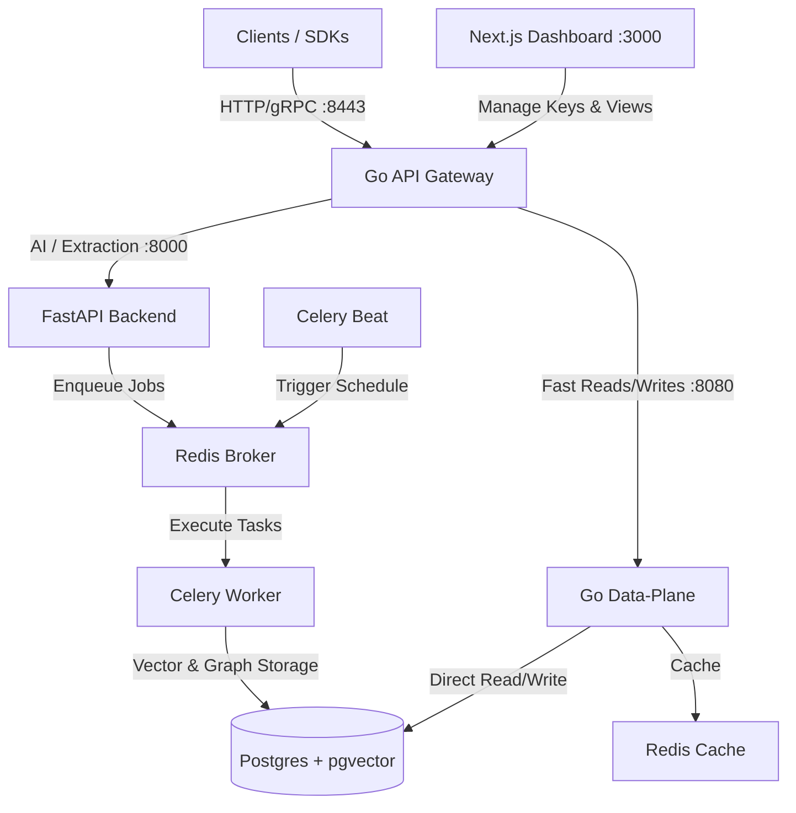

# Contexta 🧠

### The Self-Hosted Memory Intelligence Layer for AI Agents

Contexta is an enterprise-grade, self-hosted memory layer that gives your AI agents persistent, long-term memory across sessions. Stop paying for expensive, third-party closed SaaS solutions. Keep your user data secure, isolated, and running with ultra-low latency on your own infrastructure.

---

## Why Contexta?

As AI agents move from simple chatbots to autonomous assistants, they struggle with two major limitations:
1. **Token Budgets**: Shoveling entire conversation histories into context windows is expensive and leads to "lost in the middle" attention issues.
2. **Data Privacy & Cost**: Relying on closed-source memory APIs exposes sensitive user data and creates high recurring API costs.

**Contexta solves this by running a specialized memory pipeline directly on your stack.** It extracts, consolidates, scores, and retrieves memories dynamically based on semantic relevance and relational graphs.

---

## 🎯 Target Use Cases

* **Personalized AI Assistants**: Build agents that actually remember user preferences, life facts, and history over months without polluting system prompts.
* **Multi-Tenant SaaS Applications**: Offer isolated memory partitions for thousands of users or companies, fully compliant with strict data residency requirements.
* **Customer Support & CRM Bots**: Let your support agents seamlessly continue conversations with full context of past interactions and resolved issues.
* **Completely Air-Gapped/On-Prem Deployments**: Ideal for healthcare, finance, or defense agents requiring local database vector storage and zero external API dependencies.

---

## 🚀 Key Features

* 👤 **Tenant Isolation & Multi-Tenancy**: Complete cryptographic and relational segregation of memory pools by user, session, and organization out of the box.
* 🔄 **Autonomous Memory Lifecycle ("Dream Cycles")**:
  * **Continuous Extraction**: Background workers analyze conversations to extract facts, entities, preferences, and relationships.
  * **Memory Reflection**: Scheduled cron tasks automatically merge duplicate facts and resolve contradictions.
  * **Importance & Auto-Decay**: Intelligently scores and decays memories over time, ensuring only high-utility context is retrieved.
* 🔍 **Hybrid Graph & Semantic Retrieval**: Combines high-speed vector embeddings (`pgvector`) with relational graph traversals to build rich, contextual system prompts.
* ⚡ **High-Performance Polyglot Architecture**:
  * **Go Microservices** (Gateway & Data-Plane) for <10ms read/write path.
  * **Python FastAPI & Celery** for heavy-lifting LLM extractions and scheduling.
* 🔌 **Deterministic Local Mocking**: Develop and test offline without needing OpenAI or DeepSeek API keys.

---

## 📦 Production-Ready & Ultra-Lightweight

Contexta is built from the ground up to be resource-efficient and fast to deploy. Our Docker images are optimized for minimal footprints:

| Service | Docker Image / Base | Build Size | Role |
| :--- | :--- | :---: | :--- |
| **Go Gateway** | `gcr.io/distroless/static-debian12` | **~25 MB** | Directs API traffic, handles auth and routing |
| **Go Data-Plane** | `gcr.io/distroless/static-debian12` | **~28 MB** | Fast vector read/writes, graph querying |
| **Go Aggregator** | `gcr.io/distroless/static-debian12` | **~22 MB** | Runs offline cleanups and health tasks |
| **Web Dashboard** | `node:22-alpine` (Next.js Standalone) | **~165 MB** | Sleek management UI, API keys, memory explorer |
| **Python Backend** | `python:3.12-slim` | **~215 MB** | FastAPI, Celery workers, and LLM orchestration |

---

## 📐 Architecture

Contexta separates high-throughput retrieval from complex background extraction:



---

## ⚡ Quick Start

Deploy the entire Contexta stack (FastAPI, Go Services, Next.js Dashboard, Postgres + pgvector, Redis, and Celery Workers) in under a minute.

### 1. Start the Stack

Clone the repository and run:

```bash
docker compose up --build
```
*Note: By default, Contexta uses a local `deterministic` embedding provider, meaning **you do not need a paid OpenAI/DeepSeek key to get started**.*

### 2. Configure Environment

Copy the example environment file and configure your models (e.g., OpenAI or DeepSeek):

```bash
cp .env.example .env
```

Edit your `.env` to specify your preferred LLM provider:

```env
CONTEXTA_LLM_PROVIDER=openai
CONTEXTA_LLM_API_KEY=your-openai-api-key
CONTEXTA_EMBEDDING_PROVIDER=openai
CONTEXTA_EMBEDDING_API_KEY=your-openai-api-key
```

### 3. Access the Management Dashboard

1. Open your browser and navigate to **`http://localhost:3000`**.
2. Log in with any email and a password of at least 8 characters (development login).
3. Navigate to **API Keys** and generate a new key.

---

## 🔌 SDK Integration

### Python SDK

```bash
pip install contexta-client
```

```python
from contexta_client import contexta

# Reads CONTEXTA_API_KEY and CONTEXTA_API_URL from environment
memory = contexta.from_env()

# 1. Observe a new interaction
memory.observe(
    user_id="user_123",
    messages=[
        {"role": "user", "content": "I prefer historic boutique hotels and love drinking matcha tea."},
        {"role": "assistant", "content": "Got it! I will remember that for your future itineraries."}
    ],
)

# 2. Retrieve personalized context for your next prompt
ctx = memory.context(user_id="user_123", token_budget=1500)

# 3. Augment your system prompt
system_prompt = f"You are a helpful travel assistant.\n\n{ctx.to_system_prompt()}"
```

### TypeScript SDK

```bash
npm install @contexta/client
```

```typescript
import { contexta } from "@contexta/client";

const memory = contexta.fromEnv();

// 1. Observe a conversation
await memory.observe({
  userId: "user_123",
  messages: [
    { role: "user", content: "I prefer historic boutique hotels and love drinking matcha tea." }
  ]
});

// 2. Retrieve structured context
const ctx = await memory.context({ userId: "user_123" });
console.log(ctx.toSystemPrompt());
```

---

## 🛠️ Local Development

### Python Backend & Tests
```bash
# Set up virtual environment and install dev dependencies
pip install -e ".[dev]"

# Run test suite
pytest
```

### Next.js Dashboard
```bash
cd web
npm install
npm run dev
```

---

## 📜 License & Pricing Model

Contexta is available under a **dual-licensing model**:

* **Free & Open for Self-Use (Apache 2.0)**: For individual developers, hobbyists, non-commercial self-hosting, and internal testing or development. You are free to run, modify, and integrate Contexta under the terms of the Apache 2.0 License.
* **Commercial & Business Use**: If you are a commercial entity, business, or are using this software to power a commercial SaaS, product, or enterprise platform, a paid license is required.

For commercial license inquiries, dedicated enterprise support, or custom SLAs, please contact [licensing@contexta.dev](mailto:licensing@contexta.dev) or view our [Docs Pricing Section](docs/src/app/pricing/page.mdx).
