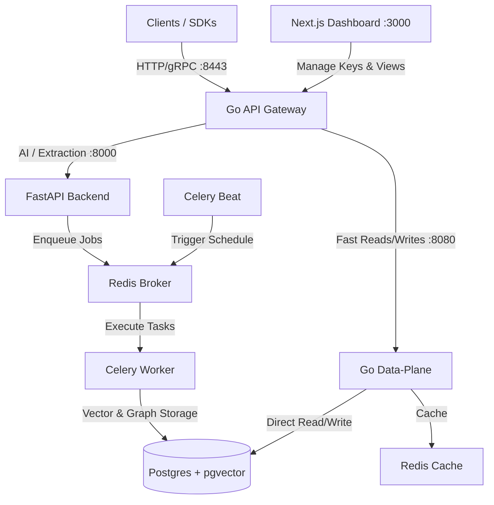

# Contexta 🧠

**Contexta** is a self-hosted, open-source memory intelligence layer for AI agents. It enables agent developers to give their agents persistent, long-term memory across sessions without relying on expensive, third-party closed SaaS solutions. Keep your agent data isolated, secure, and running completely for free.

---

## Key Features

- 👤 **Tenant Isolation & Multi-Tenancy**: Clean segregation of memory pools by user, session, and organization.
- 🔄 **Autonomous Memory Lifecycle**:
  - **Memory Extraction**: Background analysis of conversations to identify user facts, preferences, and entity relations.
  - **Reconciliation & Reflection**: Periodic "dream cycles" to merge duplicate facts and resolve contradictions.
  - **Auto-Decay**: Automatically calculates memory importance over time, keeping your prompt windows lean.
- 🔍 **Hybrid Graph & Semantic Retrieval**: Combines semantic search (using `pgvector`) with relational graph traversals for rich context building.
- ⚡ **Dual-Language Architecture**: 
  - **Go services** (API Gateway & Data-Plane) for ultra-low latency reads/writes.
  - **FastAPI / Celery (Python)** for heavy lifting like AI extraction, token budget calculations, and scheduling.
- 🔌 **Deterministic Offline Fallbacks**: Test and develop locally without configuring OpenAI or DeepSeek API keys.
- 🖥️ **Next.js Management Dashboard**: A sleek, premium dashboard to manage API keys, explore memories, inspect usage logs, and view interactive documentation.

---

## Architecture

Contexta separates high-throughput retrieval from complex background processing:



---

## Quick Start (Run for Free)

The easiest way to run the entire Contexta stack (FastAPI, Go Services, Next.js Dashboard, Postgres + pgvector, Redis, and Celery Workers) is using Docker Compose.

### 1. Start the Stack

Clone the repository and spin up all services:

```bash
docker compose up --build
```

*Note: By default, Contexta uses a local `deterministic` embedding provider, meaning **you do not need a paid OpenAI/DeepSeek key to get started**.*

### 2. Configure Environment

Copy the environment example and configure your models (e.g., OpenAI or DeepSeek):

```bash
cp .env.example .env
```

Edit your `.env` to specify your preferred LLM provider:

```env
CONTEXTA_LLM_PROVIDER=openai
CONTEXTA_LLM_API_KEY=your-openai-api-key
CONTEXTA_EMBEDDING_PROVIDER=openai
CONTEXTA_EMBEDDING_API_KEY=your-openai-api-key
```

### 3. Generate an API Key

1. Open your browser and navigate to the Dashboard at **`http://localhost:3000`**.
2. Log in with any email and a password of at least 8 characters (development login).
3. Navigate to **API Keys** and generate a new key.

---

## SDK Integration

Integrate Contexta into your agent loop in just a few lines of code.

### Python SDK

```bash
pip install contexta-client
```

```python
from contexta_client import contexta

# Automatically reads CONTEXTA_API_KEY and CONTEXTA_API_URL
memory = contexta.from_env()

# 1. Feed conversations to the memory layer
memory.observe(
    user_id="user_123",
    messages=[
        {"role": "user", "content": "I prefer historic boutique hotels and love drinking matcha tea."},
        {"role": "assistant", "content": "Got it! I will remember that for your future itineraries."}
    ],
)

# 2. Retrieve personalized context for your next LLM prompt
ctx = memory.context(user_id="user_123", token_budget=1500)

# 3. Add to your system prompt
system_prompt = f"You are a helpful assistant.\n\n{ctx.to_system_prompt()}"
```

### TypeScript SDK

```bash
npm install @contexta/client
```

```typescript
import { contexta } from "@contexta/client";

const memory = contexta.fromEnv();

// 1. Observe a conversation
await memory.observe({
  userId: "user_123",
  messages: [
    { role: "user", content: "I prefer historic boutique hotels and love drinking matcha tea." }
  ]
});

// 2. Retrieve structured context
const ctx = await memory.context({ userId: "user_123" });
console.log(ctx.toSystemPrompt());
```

---

## Local Development

### Python Backend & Tests

To work on the FastAPI backend:

```bash
# Set up virtual environment and install dev dependencies
pip install -e ".[dev]"

# Run tests
pytest
```

### Web Dashboard

To run the Next.js frontend in development mode:

```bash
cd web
npm install
npm run dev
```

---

## License

This project is licensed under the [MIT License](LICENSE).
