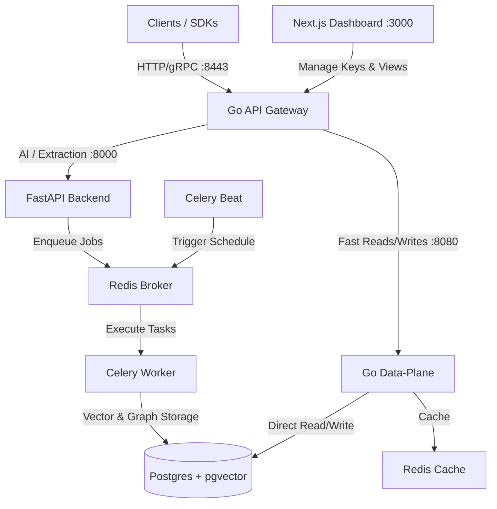

# Contexta 🧠

### The Self-Hosted Memory Intelligence Layer for AI Agents

Contexta is an enterprise-grade, self-hosted memory layer that gives your AI agents persistent, long-term memory across sessions. Stop paying for expensive, third-party closed SaaS solutions. Keep your user data secure, isolated, and running with ultra-low latency on your own infrastructure.

---

## Why Contexta?

As AI agents move from simple chatbots to autonomous assistants, they struggle with two major limitations:
1. **Token Budgets**: Shoveling entire conversation histories into context windows is expensive and leads to "lost in the middle" attention issues.
2. **Data Privacy & Cost**: Relying on closed-source memory APIs exposes sensitive user data and creates high recurring API costs.

**Contexta solves this by running a specialized memory pipeline directly on your stack.** It extracts, consolidates, scores, and retrieves memories dynamically based on semantic relevance and relational graphs.

---

## 🎯 Target Use Cases

* **Personalized AI Assistants**: Build agents that actually remember user preferences, life facts, and history over months without polluting system prompts.
* **Multi-Tenant SaaS Applications**: Offer isolated memory partitions for thousands of users or companies, fully compliant with strict data residency requirements.
* **Customer Support & CRM Bots**: Let your support agents seamlessly continue conversations with full context of past interactions and resolved issues.
* **Completely Air-Gapped/On-Prem Deployments**: Ideal for healthcare, finance, or defense agents requiring local database vector storage and zero external API dependencies.

---

## 🚀 Key Features

* 👤 **Tenant Isolation & Multi-Tenancy**: Complete cryptographic and relational segregation of memory pools by user, session, and organization out of the box.
* 🔄 **Autonomous Memory Lifecycle ("Dream Cycles")**:
  * **Continuous Extraction**: Background workers analyze conversations to extract facts, entities, preferences, and relationships.
  * **Memory Reflection**: Scheduled cron tasks automatically merge duplicate facts and resolve contradictions.
  * **Importance & Auto-Decay**: Intelligently scores and decays memories over time, ensuring only high-utility context is retrieved.
* 🔍 **Hybrid Graph & Semantic Retrieval**: Combines high-speed vector embeddings (`pgvector`) with relational graph traversals to build rich, contextual system prompts.
* ⚡ **High-Performance Polyglot Architecture**:
  * **Go Microservices** (Gateway & Data-Plane) for <10ms read/write path.
  * **Python FastAPI & Celery** for heavy-lifting LLM extractions and scheduling.
* 🔌 **Deterministic Local Mocking**: Develop and test offline without needing OpenAI or DeepSeek API keys.

---

## 📦 Production-Ready & Ultra-Lightweight

Contexta is built from the ground up to be resource-efficient and fast to deploy. Our Docker images are optimized for minimal footprints:

| Service | Docker Image / Base | Build Size | Role |
| :--- | :--- | :---: | :--- |
| **Go Gateway** | `gcr.io/distroless/static-debian12` | **~25 MB** | Directs API traffic, handles auth and routing |
| **Go Data-Plane** | `gcr.io/distroless/static-debian12` | **~28 MB** | Fast vector read/writes, graph querying |
| **Go Aggregator** | `gcr.io/distroless/static-debian12` | **~22 MB** | Runs offline cleanups and health tasks |
| **Web Dashboard** | `node:22-alpine` (Next.js Standalone) | **~165 MB** | Sleek management UI, API keys, memory explorer |
| **Python Backend** | `python:3.12-slim` | **~215 MB** | FastAPI, Celery workers, and LLM orchestration |

---

## 📐 Architecture

Contexta separates high-throughput retrieval from complex background extraction:


```mermaid
graph TD
    Client[Clients / SDKs] -->|HTTP/gRPC :8443| Gateway[Go API Gateway]
    Gateway -->|Fast Reads/Writes :8080| DP[Go Data-Plane]
    Gateway -->|AI / Extraction :8000| Backend[FastAPI Backend]
    Backend -->|Enqueue Jobs| Queue[Redis Broker]
    Queue -->|Execute Tasks| Worker[Celery Worker]
    Beat[Celery Beat] -->|Trigger Schedule| Queue
    Worker -->|Vector & Graph Storage| DB[(Postgres + pgvector)]
    DP -->|Direct Read/Write| DB
    DP -->|Cache| RedisCache[Redis Cache]
    Web[Next.js Dashboard :3000] -->|Manage Keys & Views| Gateway
```

---

## ⚡ Quick Start

Deploy the entire Contexta stack (Python API + workers, Go data-plane/gateway, Next.js dashboard, Postgres + pgvector, Redis, local Qwen3 model-server) in under a minute.

### 1. Start the Stack (Single Command)

Clone the repository and run:

**macOS & Linux:**
```bash
./entrypoint.sh
```

**Windows (PowerShell):**
```powershell
.\start.ps1
```

*(Or via Docker Compose directly: `cp .env.example .env && docker compose up --build`)*

*No API keys needed.* Default mode is **offline**: Qwen3-Embedding-0.6B + Qwen3-Reranker-0.6B auto-download to `./models` on first boot, 1024-dim embeddings, zero data egress.

Additional Commands:
```bash
# View service status / logs
./entrypoint.sh status
./entrypoint.sh logs

# Cloud models (OpenAI embeddings 1536-dim + BYOK classifier LLM)
./entrypoint.sh online

# Strict multi-tenant gateway enforcement
./entrypoint.sh enterprise

# Stop services
./entrypoint.sh stop
```

> Switching embedding dimensions (1024 offline ↔ 1536 online) needs a fresh DB volume: `docker compose down -v` first.

### 2. Configure Environment (online mode only)

For cloud models, set in `.env`:

```env
CONTEXTA_ENGINE_MODE=online
CONTEXTA_LLM_PROVIDER=openai
CONTEXTA_LLM_MODEL=gpt-4o-mini
CONTEXTA_LLM_API_KEY=your-key
CONTEXTA_EMBEDDING_PROVIDER=openai
CONTEXTA_EMBEDDING_MODEL=text-embedding-3-small
CONTEXTA_EMBEDDING_DIMENSIONS=1536
CONTEXTA_EMBEDDING_API_KEY=your-key
```

### 3. Access the Management Dashboard

1. Open your browser and navigate to **`http://localhost:3000`**.
2. Log in with any email and a password of at least 8 characters (development login).
3. Navigate to **API Keys** and generate a new key.

---

## 🔌 SDK Integration

### Python SDK

```bash
pip install contexta-client
```

```python
from contexta_client import contexta

# Reads CONTEXTA_API_KEY and CONTEXTA_API_URL from environment
memory = contexta.from_env()

# 1. Observe a new interaction
memory.observe(
    user_id="user_123",
    messages=[
        {"role": "user", "content": "I prefer historic boutique hotels and love drinking matcha tea."},
        {"role": "assistant", "content": "Got it! I will remember that for your future itineraries."}
    ],
)

# 2. Retrieve personalized context for your next prompt
ctx = memory.context(user_id="user_123", token_budget=1500)

# 3. Augment your system prompt
system_prompt = f"You are a helpful travel assistant.\n\n{ctx.to_system_prompt()}"
```

### TypeScript SDK

```bash
npm install @contexta/client
```

```typescript
import { contexta } from "@contexta/client";

const memory = contexta.fromEnv();

// 1. Observe a conversation
await memory.observe({
  userId: "user_123",
  messages: [
    { role: "user", content: "I prefer historic boutique hotels and love drinking matcha tea." }
  ]
});

// 2. Retrieve structured context
const ctx = await memory.context({ userId: "user_123" });
console.log(ctx.toSystemPrompt());
```

### MCP Server (Claude Desktop, Cursor, Windsurf)

Stdio (local clients) — needs `CONTEXTA_DATABASE_URL` pointing at the stack's Postgres:

```bash
python -m contexta.mcp
```

```json
{
  "mcpServers": {
    "contexta": { "command": "python", "args": ["-m", "contexta.mcp"] }
  }
}
```

Or SSE transport: `python -m contexta.mcp --transport sse --port 8765`, then `"url": "http://localhost:8765/sse"`.

Tools: `contexta_remember`, `contexta_recall`, `contexta_get_context`, `contexta_explore_graph`, `contexta_forget`, `contexta_batch_remember`, `contexta_dream`, `contexta_metrics`.

---

## 🛠️ Local Development

### Python Backend & Tests
```bash
# Set up virtual environment and install dev dependencies
pip install -e ".[dev]"

# Run test suite
pytest
```

### Next.js Dashboard
```bash
cd web
npm install
npm run dev
```

---

## 🤝 Contributing

We love our open-source community! Contexta is fully open-source, and we welcome contributions of all kinds. Currently, we are specifically looking for help to:
1. **Enhance the Dashboard UI**: Improve the Next.js dashboard with better aesthetics, modern components, and improved UX.
2. **Clean the Codebase**: Refactor legacy code, improve architecture, and help keep the codebase clean and maintainable.

Check out our [CONTRIBUTING.md](CONTRIBUTING.md) for more details on how to get started.

---

## 📜 License

Contexta is fully open-source and available under the **Apache 2.0 License**. You are free to use, modify, distribute, and integrate Contexta in both personal and commercial projects.
