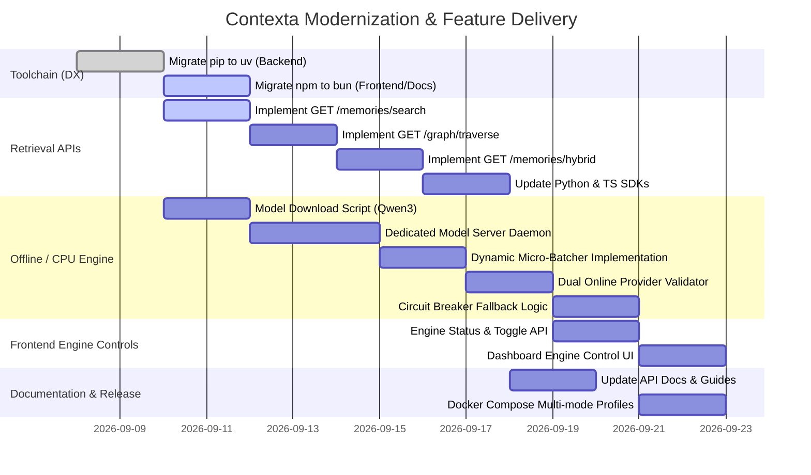

# Contexta: Comprehensive Architectural Roadmap & Implementation Plan

> **Status:** Active / Ready for Execution  
> **Target System:** Contexta Core Memory Engine, API Services, SDKs, and Web Frontend  
> **Location:** `Memento/to-do/list.md`

---

## Executive Summary

This roadmap establishes the structural overhaul and operational plan for **Contexta**, the enterprise-grade, self-hosted memory layer for AI agents. The document addresses four foundational priorities:
1. **Pipeline & System Architecture:** Formalizing how Contexta extracts, graphs, stores, consolidates ("dream cycles"), and retrieves memories.
2. **Toolchain & Developer Experience (DX):** Transitioning dependency and runtime management from `pip` to `uv` (Python backend) and from `npm` to `bun` (frontend & docs), dramatically accelerating builds and developer workflows.
3. **Dedicated Retrieval Mode Endpoints:** Standardizing distinct HTTP endpoints for Vector, Graph, and Hybrid retrieval modes with clear parameter contracts.
4. **Offline / CPU-Only vs. Online API Engine:** Engineering full dual-mode support enabling seamless air-gapped CPU operation (local embeddings + micro-LLM), cloud operation (OpenAI/Cohere/DeepSeek), and intelligent dynamic fallback.

---

## 1. Requirements, Pipeline Architecture, Logic & Use Cases

### 1.1 Core Mission
AI agents suffer from two primary memory challenges:
- **Token Inflation & Attention Loss ("Lost-in-the-Middle"):** Shoveling thousands of lines of conversation history into agent context windows exhausts token budgets, degrades response reasoning, and skyrockets inference costs.
- **Privacy & Compliance Exposure:** Relying on third-party memory APIs introduces data residency hazards and recurring per-user API overhead.

**Contexta solves this** by acting as an intelligent, self-hosted memory operating system that continuously extracts facts, tracks entities, models relationships, decays stale memories, and injects high-density, budgeted context on demand.

---

### 1.2 The Memory Pipeline

The Contexta pipeline operates across four orchestrated stages:

```
[Agent / Application]
         │
         ▼  POST /v1/observations
┌─────────────────────────────────────────────────────────────┐
│ 1. INGESTION & BOUNDARY ENFORCEMENT                         │
│  - Multi-tenant cryptographic isolation (Tenant / Org / User)│
│  - Sensitive data filter & PII redaction (Regex + Ent-detect)│
│  - Fast acknowledgement (<15ms) -> Enqueue to Redis broker   │
└──────────────────────────────┬──────────────────────────────┘
                               │
                               ▼
┌─────────────────────────────────────────────────────────────┐
│ 2. ASYNC EXTRACTION & GRAPH GROUNDING (Celery Worker)        │
│  - LLM Extraction: Facts, Preferences, Goals, Temporal State│
│  - Semantic Embedding: Dense vector generation (1536-dim)   │
│  - Entity Resolution: Entity linking & typed relationship   │
│    graph edges (e.g. (User)-[PREFERS]->(Postgres))          │
│  - Storage: PostgreSQL (Relational + JSONB + pgvector HNSW) │
└──────────────────────────────┬──────────────────────────────┘
                               │
                               ▼
┌─────────────────────────────────────────────────────────────┐
│ 3. AUTONOMOUS LIFECYCLE & "DREAM CYCLES" (Celery Beat)       │
│  - Reflection Engine: Deduplication & cluster consolidation │
│  - Supersession Chains: Contradiction resolution            │
│    (valid_from, valid_to, superseded_by_id)                 │
│  - Importance & Decay Engine: Half-life access decay        │
│    (Active -> Warm -> Cold -> Archived); Pinned exemptions  │
└──────────────────────────────┬──────────────────────────────┘
                               │
                               ▼  GET /memories/search | /graph/traverse | /memories/hybrid
┌─────────────────────────────────────────────────────────────┐
│ 4. MULTI-SIGNAL RETRIEVAL & SYNTHESIS                        │
│  - Query analysis & entity mention detection                │
│  - Candidate generation (Vector cosine + Graph BFS + BM25)  │
│  - Reciprocal Rank Fusion (RRF) & multi-signal scoring      │
│  - Maximal Marginal Relevance (MMR λ=0.7) diversification   │
│  - Token-budgeted context formatting (`to_system_prompt()`) │
└─────────────────────────────────────────────────────────────┘
```

#### Pipeline Logic & Formulas
1. **Recency Decay Formula:**
   $$\text{Score}_{\text{recency}} = \exp\left(-\frac{\ln(2) \times \Delta t_{\text{days}}}{30}\right)$$
   Memories untouched for 30 days degrade to $0.50$; memories accessed today score $\approx 1.0$.
2. **Hybrid Composite Ranking Score:**
   $$\text{Score}_{\text{final}} = 0.40 \cdot S_{\text{vector}} + 0.25 \cdot S_{\text{graph}} + 0.20 \cdot S_{\text{importance}} + 0.10 \cdot S_{\text{recency}} + 0.05 \cdot S_{\text{bm25}} + S_{\text{cluster\_bonus}} - P_{\text{cold}} - P_{\text{archived}}$$
3. **Diversification:**
   Maximal Marginal Relevance (MMR) with $\lambda = 0.70$ prevents repetitive near-duplicate memories from consuming the agent's context budget.

---

### 1.3 Target Use Cases

| Use Case | Architecture Fit | Primary Benefit |
| :--- | :--- | :--- |
| **Personalized AI Assistants** | Long-term memory profile with preference & goal tracking | Remembers user constraints, style, and past interactions across months without manual prompt crafting. |
| **Multi-Tenant B2B SaaS** | Tenant-scoped PostgreSQL schemas & row-level security | Completely isolated customer workspaces with guaranteed cross-tenant segregation. |
| **Customer Support Copilots** | Session observation + entity graph | Immediate context recall of user account history, past tickets, and technical setups. |
| **Air-Gapped / High-Compliance (Health/Gov/Fin)** | Offline CPU-only engine with local GGUF models | 100% on-prem execution with zero data egress, satisfying strict HIPAA, GDPR, and defense air-gap policies. |

---

## 2. Developer Experience (DX) Modernization

### 2.1 Python Stack: Migration from `pip` to `uv`

#### Rationale & Compatibility
- **Speed:** `uv` (by Astral) provides 10-100x faster package resolution and installation compared to standard `pip` and `virtualenv`.
- **Reproducibility:** Native lockfile support (`uv.lock`) eliminates subtle version discrepancies between local development and CI/Docker builds.
- **Compatibility:** Contexta's Python codebase (`pyproject.toml` using `hatchling`, FastAPI, SQLAlchemy 2.0, asyncpg, Celery, pgvector, Pydantic v2) uses standard wheels and is **100% compatible** with `uv`.

#### Changes Required

1. **Root `pyproject.toml` Optimization:**
   - Maintain PEP 517/621 standards.
   - Introduce `tool.uv` section for explicit workspace dependencies and index definitions.
2. **Local Development Workflow:**
   - *Old:* `python -m venv .venv && source .venv/bin/activate && pip install -e ".[dev]"`
   - *New:*
     ```bash
     uv venv
     uv sync --extra dev
     uv run pytest
     ```
3. **Dockerfile Refactoring:**
   Replace slow `pip install` layers with multi-stage `uv` binary caching:
   ```dockerfile
   FROM ghcr.io/astral-sh/uv:latest AS uv_bin
   FROM python:3.12-slim

   WORKDIR /app
   COPY --from=uv_bin /uv /uvx /bin/

   # Copy pyproject and lockfile for ultra-fast cached install
   COPY pyproject.toml uv.lock* ./
   RUN uv sync --frozen --no-dev --no-install-project

   COPY . .
   RUN uv sync --frozen --no-dev
   ENV PATH="/app/.venv/bin:$PATH"
   ```
4. **CI/CD Actions:**
   Update GitHub Actions (`.github/workflows/*.yml`) to use `astral-sh/setup-uv@v4`.

---

### 2.2 JavaScript / TypeScript Stack: Migration from `npm` to `bun`

#### Rationale & Compatibility Audit
The monorepo contains three Node.js web/docs projects and a TypeScript client:
1. `web/` (Next.js 15.5, React 19, Tailwind CSS v4, Radix, Framer Motion)
2. `web-public/` (Next.js 16 canary, React 19, Tailwind CSS v4, Motion, local workspace package link)
3. `docs/` (Next.js 14.2, React 18, Nextra 2, rehype/remark)
4. `clients/typescript/` (TypeScript client library)

#### Compatibility Assessment:
- **Package Management:** `bun install` is a drop-in replacement for `npm install`. It is 20-30x faster and respects `file:` workspace links (`@aethlon/components: file:../../Aethlon_polyrepo/components`).
- **Next.js Execution:** Bun runs Next.js dev scripts (`bun run dev`) and builds (`bun run build`) without issues on Next.js 14, 15, and 16.
- **Lockfile Migration:** Replace `package-lock.json` with `bun.lock` across all web directories.

#### Changes Required

1. **Web Dashboard (`web/`):**
   ```bash
   cd web
   rm -f package-lock.json
   bun install
   ```
2. **Landing Site (`web-public/`):**
   ```bash
   cd web-public
   rm -f package-lock.json
   bun install
   ```
3. **Documentation (`docs/`):**
   ```bash
   cd docs
   rm -f package-lock.json
   bun install
   ```
4. **Docker Container Builds:**
   Update Next.js Dockerfiles from `node:22-alpine` to `oven/bun:1-alpine` for faster image builds and smaller memory footprints.
5. **Documentation Updates:**
   Update `README.md`, `CONTRIBUTING.md`, and docs pages to prescribe `bun install && bun run dev`.

---

## 3. Dedicated Retrieval Endpoints Specification

Contexta supports three explicit retrieval paradigms. To provide clear ergonomics for agent developers, the API provides distinct endpoints alongside the unified `POST /v1/retrieve`.

### 3.1 Endpoint Breakdown

| Mode | Endpoint | Method | Core Parameters | Best For |
| :--- | :--- | :---: | :--- | :--- |
| **Vector** | `/memories/search` | `GET` | `query`, `limit`, `threshold`, `user_id` | Fast semantic similarity, fuzzy conceptual search, zero graph overhead. |
| **Graph** | `/graph/traverse` | `GET` | `source`, `hops`, `relationship_types`, `direction` | Entity relationship mapping, hierarchy drill-downs, connected fact discovery. |
| **Hybrid** | `/memories/hybrid` | `GET` | `query`, `max_hops`, `vector_weight`, `graph_weight`, `limit` | Agent context assembly combining dense vectors, entity traversal, and recency scoring. |

---

### 3.2 Detailed Endpoint Contracts

#### 1. Vector Search: `GET /memories/search`
Executes pure dense cosine distance search over pgvector HNSW indexes.
- **Query Parameters:**
  - `query` (string, required): Search query text.
  - `user_id` (UUID, optional): Filter by user ID.
  - `limit` (int, default=20, max=100): Maximum memories to return.
  - `threshold` (float, default=0.65): Minimum cosine similarity cutoff ($0.0 \dots 1.0$).
  - `memory_type` (string, optional): Filter (`fact`, `preference`, `goal`, `event`).
- **Sample Request:**
  ```http
  GET /memories/search?query=preferred+database+stack&limit=5&threshold=0.70 HTTP/1.1
  Authorization: Bearer mk_live_...
  ```
- **Sample Response:**
  ```json
  {
    "mode": "vector",
    "query": "preferred database stack",
    "count": 1,
    "results": [
      {
        "id": "a5e8f49a-0000-4000-8000-000000000001",
        "title": "Database Preference",
        "content": "User prefers PostgreSQL with pgvector for storage.",
        "similarity": 0.912,
        "memory_type": "preference",
        "tags": ["database", "infrastructure"],
        "created_at": "2026-04-12T18:32:11Z"
      }
    ]
  }
  ```

---

#### 2. Graph Traversal: `GET /graph/traverse`
Executes multi-hop breadth-first traversal across entity edges and memory-entity links.
- **Query Parameters:**
  - `source` (UUID or string, required): Root entity ID or exact entity name.
  - `hops` (int, default=2, max=3): Graph exploration depth.
  - `relationship_types` (string, optional): Comma-separated list (e.g. `works_on,prefers,depends_on`).
  - `direction` (string, default=`both`): `outgoing`, `incoming`, or `both`.
- **Sample Request:**
  ```http
  GET /graph/traverse?source=PostgreSQL&hops=2&direction=both HTTP/1.1
  Authorization: Bearer mk_live_...
  ```
- **Sample Response:**
  ```json
  {
    "mode": "graph",
    "root_entity": {
      "id": "e1111111-2222-3333-4444-555555555555",
      "name": "PostgreSQL",
      "entity_type": "technology"
    },
    "hops": 2,
    "nodes": [
      {"id": "e1111111-2222-3333-4444-555555555555", "name": "PostgreSQL", "type": "technology"},
      {"id": "e9999999-8888-7777-6666-555555555555", "name": "Project Apollo", "type": "project"}
    ],
    "edges": [
      {"source": "Project Apollo", "target": "PostgreSQL", "relationship": "USES"}
    ],
    "linked_memories": [
      {
        "id": "a5e8f49a-0000-4000-8000-000000000001",
        "title": "Apollo Stack Selection",
        "content": "Project Apollo decided on Postgres and asyncpg."
      }
    ]
  }
  ```

---

#### 3. Hybrid Retrieval: `GET /memories/hybrid`
Blends semantic vector search, entity graph expansion, BM25 keyword matching, recency decay, and importance scoring.
- **Query Parameters:**
  - `query` (string, required): Full text prompt or search phrase.
  - `max_hops` (int, default=2, max=3): Graph expansion hop limit.
  - `limit` (int, default=20): Top result cut-off.
  - `vector_weight` (float, default=0.40): Weight multiplier for vector similarity.
  - `graph_weight` (float, default=0.25): Weight multiplier for graph proximity.
  - `include_cold` (bool, default=false): Include memories in cold tier.
- **Sample Request:**
  ```http
  GET /memories/hybrid?query=what+tools+does+the+user+use+for+backend%3F&max_hops=2&limit=10 HTTP/1.1
  Authorization: Bearer mk_live_...
  ```
- **Sample Response:**
  ```json
  {
    "mode": "hybrid",
    "query": "what tools does the user use for backend?",
    "results": [
      {
        "memory_id": "a5e8f49a-0000-4000-8000-000000000001",
        "title": "Prefers Postgres & FastAPI",
        "content": "User prefers FastAPI and PostgreSQL for backend services.",
        "score": 0.884,
        "score_breakdown": {
          "semantic": 0.92,
          "graph": 0.85,
          "importance": 0.80,
          "recency": 0.95,
          "keyword": 0.60
        }
      }
    ]
  }
  ```

---

### 3.3 SDK Alignment
Expose dedicated convenience methods in the client SDKs:

```python
# Python Client
memories = client.search("PostgreSQL", threshold=0.7)
graph = client.traverse(source="PostgreSQL", hops=2)
hybrid_context = client.hybrid("backend preferences", max_hops=2)
```

```typescript
// TypeScript Client
const memories = await client.search({ query: "PostgreSQL", threshold: 0.7 });
const graph = await client.traverse({ source: "PostgreSQL", hops: 2 });
const hybridContext = await client.hybrid({ query: "backend preferences", maxHops: 2 });
```

---

## 4. Backend Engine Architecture: Offline/CPU vs. Online API Mode

Contexta features a dual-engine architecture capable of running 100% offline on standard CPUs or utilizing hosted cloud model APIs, with continuous automatic fallback.

---

### 4.1 Designated Models & Role Specification

```
┌──────────────────────────────────────────────────────────────────────────────────┐
│                             CONTEXTA ENGINE MODES                                │
├─────────────────────────────────────────┬────────────────────────────────────────┤
│           OFFLINE / CPU-ONLY            │          ONLINE / CLOUD API            │
│  (100% Local, Zero Cloud Exfiltration)  │      (High Throughput & Scale)         │
├─────────────────────────────────────────┼────────────────────────────────────────┤
│ • Embeddings:                           │ • Embeddings:                          │
│   Qwen/Qwen3-Embedding-0.6B             │   OpenAI text-embedding-3-small/large, │
│   (~1024-dim dense vectors)             │   Cohere Embed v3                      │
│ • Classification & Reranking:           │ • LLM for Extraction & Reflection:     │
│   Qwen/Qwen3-Reranker-0.6B              │   OpenAI gpt-4o-mini, DeepSeek-V3,     │
│   (Zero-shot categorization & scoring)  │   Anthropic Claude 3.5 Haiku           │
└─────────────────────────────────────────┴────────────────────────────────────────┘
```

#### A. Offline / CPU-Only Mode: High-Concurrency Model Server Architecture

Rather than relying on ad-hoc CLI subprocesses or single-threaded wrappers, Contexta utilizes an **industry-grade local inference service**. 

```
                                FastAPI API / Celery Workers
                                   │           │           │
                     Concurrent    │           │           │  Concurrent
                     Embeddings    ▼           ▼           ▼  Classifications
                        ┌─────────────────────────────────────────┐
                        │   Local Model Server (:8001 / Socket)   │
                        │   • High-Performance Async Daemon       │
                        │   • Connection-Pooled Keep-Alive        │
                        └───────────────────┬─────────────────────┘
                                            │
                                            ▼
                        ┌─────────────────────────────────────────┐
                        │      Dynamic Request Micro-Batcher      │
                        │      (2-5ms Window / Thread-Safe)       │
                        └───────────────────┬─────────────────────┘
                                            │
                     ┌──────────────────────┴──────────────────────┐
                     ▼                                             ▼
       ┌───────────────────────────┐                 ┌───────────────────────────┐
       │ Qwen/Qwen3-Embedding-0.6B │                 │ Qwen/Qwen3-Reranker-0.6B  │
       │   • Pinned in Memory      │                 │   • Pinned in Memory      │
       │   • Batched Dot-Products  │                 │   • Batched Cross-Encoder │
       │   • AVX-512 / AMX Vector  │                 │   • Multi-Thread Concurrency │
       └───────────────────────────┘                 └───────────────────────────┘
```

##### 1. "Load Once, Keep Warm" Server Lifecycle
- **Zero Runtime Reloads:** The server boots up and loads both `Qwen/Qwen3-Embedding-0.6B` and `Qwen/Qwen3-Reranker-0.6B` into system RAM **once** during startup (via FastAPI lifespan / C++ runtime initialization).
- **Persistent In-Memory Execution:** Model weights remain pinned in process memory for the entire server lifetime. Celery workers and API request handlers never call `torch.load` or spawn subprocesses; they dispatch requests to this persistent server.
- **Readiness Probes:** The server exposes `GET /health` and `GET /models/status` so upstream services wait until models are warmed before accepting traffic.

##### 2. High-Concurrency & Multi-Inference Engine
- **Asynchronous Concurrent Serving:** The model server uses an asynchronous ASGI event loop (Uvicorn / FastAPI or ONNX Runtime Server) paired with an optimized threadpool (`intra_op_num_threads` and `inter_op_num_threads`), allowing multiple workers to submit inference requests simultaneously without blocking.
- **Dynamic Micro-Batching:**
  - When multiple embedding or classification requests arrive concurrently (e.g. from multiple Celery ingestion tasks), the internal queue collects incoming payloads over a tiny window ($2\text{--}5\,\text{ms}$) and executes them as a single batched tensor operation.
  - Squeezes maximum throughput out of modern CPU instruction sets (AVX-512, Intel AMX, ARM NEON).
- **Inter-Process Communication (IPC):**
  - Upstream Contexta services communicate with the model server via high-throughput local HTTP (`http://127.0.0.1:8001`) or a Unix Domain Socket (`/tmp/contexta_models.sock`) using connection-pooled keep-alive clients (`httpx.AsyncClient`).

| Component | Designated Model | What Runs Where | How It's Loaded & Served | Concurrency & CPU Impact |
| :--- | :--- | :--- | :--- | :--- |
| **Embedding Engine** | **`Qwen/Qwen3-Embedding-0.6B`** | Generates 1024-dim dense vectors. Runs inside the persistent Local Model Server. | Loaded **once** at server boot into process RAM via `transformers` / ONNX Runtime. Pinned in memory. | Handles multiple parallel embedding calls via dynamic micro-batching. $\approx 10\text{--}20\,\text{ms}$ per batch on multi-core CPUs. |
| **Classification & Reranker Engine** | **`Qwen/Qwen3-Reranker-0.6B`** | Performs memory type classification, entity association, and cross-encoder relevance reranking. | Loaded **once** at server boot. Shared across all worker requests. | Concurrent async inference queue. $\approx 30\text{--}60\,\text{ms}$ per classification batch across threads. |
| **Dream Cycle / Scoring** | *Pure Python / SQLAlchemy* | Reflection, deduplication, contradiction chains, and decay calculations. | Scheduled asynchronous Celery Beat tasks; purely algorithmic SQL and relational logic. | Negligible CPU ($< 1\%$). |

##### 3. Local Model Endpoints
The local model daemon exposes standardized OpenAI-compatible and specialized routes:
- `POST /v1/embeddings`: Concurrent batched vector generation.
- `POST /v1/classify`: Memory type and semantic tag classification.
- `POST /v1/rerank`: Multi-candidate cross-encoder relevance scoring.
- `GET /health`: Health and memory allocation status.

##### 4. Offline Model Download & Local Cache Strategy
- **Directory Structure:**
  ```
  Memento/
  └── models/
      ├── qwen3-embedding-0.6b/     # HuggingFace weights / ONNX bundle
      │   ├── config.json
      │   ├── tokenizer.json
      │   └── model.safetensors
      └── qwen3-reranker-0.6b/      # Classification / Reranker bundle
          ├── config.json
          ├── tokenizer.json
          └── model.safetensors
  ```
- **Automated Download Tooling:**
  - Dedicated CLI command: `uv run python -m contexta.cli.models download --all`
  - Download helper script: `scripts/download_offline_models.py` (uses `huggingface_hub` with resume-download and checksum validation).
  - Docker build option: `ARG PRELOAD_OFFLINE_MODELS=true` to bake weights directly into the container image for air-gapped environments.

---

#### B. Online / API Mode (Hosted / Cloud)
When operating in online mode, **the user must explicitly configure BOTH the LLM Provider AND the Embedding Provider**. Contexta requires both services to be defined; if either is missing, online operations cannot proceed and the system alerts or degrades to the offline model.

| Required Online Component | User Configuration Contract | What Runs Where | Key Benefits |
| :--- | :--- | :--- | :--- |
| **Cloud Embedding Provider** *(Mandatory)* | - `CONTEXTA_EMBEDDING_PROVIDER` (e.g. `openai`, `cohere`)<br>- `CONTEXTA_EMBEDDING_API_KEY`<br>- `CONTEXTA_EMBEDDING_MODEL` (e.g. `text-embedding-3-small`, `text-embedding-3-large`)<br>- `CONTEXTA_EMBEDDING_BASE_URL` (optional) | Dispatched asynchronously over HTTPS to cloud embedding endpoint. | Zero local RAM/CPU overhead; industry-standard benchmark vectors; elastic scaling. |
| **Cloud LLM Provider** *(Mandatory)* | - `CONTEXTA_LLM_PROVIDER` (e.g. `openai`, `deepseek`, `anthropic`)<br>- `CONTEXTA_LLM_API_KEY`<br>- `CONTEXTA_LLM_MODEL` (e.g. `gpt-4o-mini`, `deepseek-chat`)<br>- `CONTEXTA_LLM_BASE_URL` (optional) | Prompts for extraction, JSON structuring, and memory reflection sent via HTTPS. | High reasoning capacity for nuanced entity extraction; zero GPU/CPU burden. |

> [!IMPORTANT]
> **Online Mode Requirement:** For Online Mode to be active, both `CONTEXTA_LLM_API_KEY` and `CONTEXTA_EMBEDDING_API_KEY` (along with their corresponding provider and model names) must be provided in `.env` or system environment. If only one is configured, Contexta will raise a startup validation warning and automatically fall back the unconfigured component to its offline local model server.

---

### 4.2 Decision Matrix: Offline vs. Online

| Decision Factor | Offline Mode (`Qwen3-0.6B` Stack) | Online Mode (Cloud Providers) |
| :--- | :--- | :--- |
| **Designated Models** | `Qwen/Qwen3-Embedding-0.6B` & `Qwen/Qwen3-Reranker-0.6B` | OpenAI `text-embedding-3-small` / `gpt-4o-mini`, DeepSeek, etc. |
| **Up-front Setup** | One-time model download ($\approx 1.2\,\text{GB}$ total disk storage). | Zero model downloads; requires API key generation. |
| **Ongoing Costs** | **$0.00 / token**. Completely free recurring execution. | Pay-per-token API fees (usage-based). |
| **Data Privacy** | **100% On-Premise / Air-Gapped**. Zero data leaves host. | Data sent over external network to provider endpoints. |
| **Latency** | Predictable local CPU inference ($\approx 10\text{--}40\,\text{ms}$). | Subject to network round-trips and API latency ($150\text{--}800\,\text{ms}$). |
| **Concurrency Model** | Dedicated persistent daemon with dynamic micro-batching & threadpools. | External managed concurrency (provider burst capacity). |
| **Hardware Overhead** | $\approx 2\text{--}3\,\text{GB}$ RAM for models; runs comfortably on multi-core CPUs. | Negligible host RAM/CPU consumption. |
| **Throughput Limit** | Constrained by local CPU core count. | Bound by cloud provider API tier rate limits. |

---

### 4.3 Contexta Hybrid Architecture (Default Behavior)

Contexta employs an intelligent hybrid design ensuring continuous reliability:

1. **Bootstrap Offline:**
   - On initial start without API keys, Contexta automatically defaults to the offline pipeline with the persistent `Qwen3` local model server.
2. **Switching to Online:**
   - Adding both LLM and Embedding credentials to `.env`:
     ```env
     # LLM Provider
     CONTEXTA_LLM_PROVIDER=openai
     CONTEXTA_LLM_API_KEY=sk-...
     CONTEXTA_LLM_MODEL=gpt-4o-mini

     # Embedding Provider
     CONTEXTA_EMBEDDING_PROVIDER=openai
     CONTEXTA_EMBEDDING_API_KEY=sk-...
     CONTEXTA_EMBEDDING_MODEL=text-embedding-3-small
     ```
   - Shifts all live requests to the cloud pipeline while keeping the local model server active as a warm, zero-latency fallback.
3. **Resilient Circuit-Breaker Fallback:**
   - If cloud endpoints return HTTP 429 (Rate Limit), 503, or timeout, the request seamlessly routes to the local model server without dropping agent requests.
4. **Per-Request Mode Routing:**
   - Clients can dictate engine selection via HTTP request header `X-Contexta-Engine: local | cloud | auto`.

```
                             Request Received
                                    │
                     ┌──────────────┴──────────────┐
                     ▼                             ▼
            Header: engine=local           Header: engine=cloud (or auto)
                     │                             │
                     ▼                             ▼
          [Offline Local Model Server]    [Online Cloud APIs]
          • Qwen/Qwen3-Embedding-0.6B     • Both LLM & Embedder Configured?
          • Qwen/Qwen3-Reranker-0.6B               ├── YES ──► Dispatch Cloud API
          • Dynamic Micro-Batching                 │                │
          • Persistent in RAM                      │ (Success)      ▼
                     │                             └──────────► Return Result
                     │                                              │ (HTTP 429/5xx/Timeout)
                     ▼                                              ▼
               Return Result ◄─────────────────────────── [Circuit Breaker Fallback]
```

---

### 4.4 Frontend Dashboard Integration: Live Status & Interactive Mode Toggle

To give operators and developers complete visibility and dynamic control, the Contexta Web Dashboard (`web/`) provides real-time model telemetry and an interactive engine switcher.

```
┌──────────────────────────────────────────────────────────────────────────────────┐
│                             CONTEXTA ENGINE CONTROL                              │
│                                                                                  │
│  Active Mode:  [ 💻 Offline (Local) ]  [ 🌐 Online (Cloud) ]  [ ⚡ Hybrid (Auto) ] │
│                                                                                  │
│  ┌─────────────────────────────────────┐   ┌───────────────────────────────────┐ │
│  │ Local Model Server: HEALTHY         │   │ Cloud Providers: CONNECTED        │ │
│  │ • Qwen3-Embedding-0.6B (RAM: 1.18GB)│   │ • LLM: OpenAI gpt-4o-mini (200 OK)│ │
│  │   Status: Warmed (14.2ms avg)       │   │ • Embed: text-emb-3-small (200 OK)│ │
│  │ • Qwen3-Reranker-0.6B (RAM: 1.12GB) │   │                                   │ │
│  │   Status: Warmed (41.8ms avg)       │   │ [⚙️ Manage Cloud Credentials]     │ │
│  └─────────────────────────────────────┘   └───────────────────────────────────┘ │
└──────────────────────────────────────────────────────────────────────────────────┘
```

#### 1. Real-Time Telemetry & Status Badges
- **Global Header Badge:**
  - Displays the active engine state in the top navigation:
    - 🟢 `Engine: Offline (Qwen3 CPU)`
    - 🔵 `Engine: Online (OpenAI)`
    - 🟡 `Engine: Hybrid (Auto-Fallback)`
- **Detailed Engine Telemetry Modal:**
  - **Local Model Server:**
    - Reports memory allocation (RAM consumed), process uptime, and warm status for `Qwen/Qwen3-Embedding-0.6B` and `Qwen/Qwen3-Reranker-0.6B`.
    - Live rolling average latency (ms) for embeddings and classification passes.
  - **Cloud Providers:**
    - Live connectivity verification for both configured LLM and Embedding providers.
    - Status pills: `Configured & Reachable` (green), `Unconfigured` (gray), or `Invalid Credentials / Rate Limited` (red).

#### 2. Interactive Engine Toggle (Offline vs. Online vs. Hybrid)
- **Zero-Downtime Dynamic Switching:**
  - Users can toggle between **Offline Mode**, **Online Mode**, and **Hybrid / Auto** directly from the UI settings.
  - Changes take effect immediately for the active organization or session without restarting any containers or modifying `.env` files manually.
- **Online Credential Validation Flow:**
  - When toggling to **Online Mode**, if credentials are missing or unverified, the UI opens an inline configuration modal:
    - **LLM Settings:** Provider selector (`OpenAI`, `DeepSeek`, `Anthropic`), Model name, API Key.
    - **Embedding Settings:** Provider selector (`OpenAI`, `Cohere`), Model name, API Key.
    - **"Test & Save" Action:** Hits `POST /v1/system/validate-providers` to verify connectivity for both providers before committing changes. If either test fails, the UI prevents enabling online mode and displays the exact API response error.
- **Offline Mode Fallback:**
  - Toggling to **Offline Mode** immediately routes all traffic to the local Qwen model server without querying external APIs.

#### 3. Supporting Backend API Endpoints
- **`GET /v1/system/engine-status`:**
  - Returns current engine mode, memory stats, local model warming state, and cloud provider reachability.
- **`POST /v1/system/engine-mode`:**
  - Accepts `{"mode": "offline" | "online" | "auto"}` and updates tenant/system routing rules dynamically.
- **`POST /v1/system/validate-providers`:**
  - Tests connectivity for the supplied LLM and Embedding credentials in real time.

---

## 5. Phased Implementation Roadmap



### Phase 1: Toolchain Modernization (`uv` & `bun`)
- [ ] Initialize `uv.lock` at monorepo root for Python dependencies.
- [ ] Refactor `Dockerfile` and `entrypoint.sh` to use `uv sync --frozen`.
- [ ] Migrate `web/`, `web-public/`, and `docs/` to `bun`:
  - Run `bun install` and verify build artifacts (`bun run build`).
  - Generate clean `bun.lock` files.
- [ ] Update `CONTRIBUTING.md` and `README.md` with streamlined setup commands.

### Phase 2: Dedicated Retrieval Endpoints
- [ ] Add `GET /memories/search` in `contexta/api/routes/memories.py`:
  - Pure vector similarity search via `pgvector`.
- [ ] Add `GET /graph/traverse` in `contexta/api/routes/graph.py`:
  - Multi-hop entity exploration with depth and relationship filters.
- [ ] Add `GET /memories/hybrid` in `contexta/api/routes/memories.py`:
  - Multi-signal composite ranking (vector + graph + recency + importance).
- [ ] Align Python SDK (`clients/python`) and TypeScript SDK (`clients/typescript`) with dedicated convenience helper methods.

### Phase 3: Offline / CPU Engine & Persistent Model Server
- [ ] Create `scripts/download_offline_models.py` and CLI task to fetch:
  - `Qwen/Qwen3-Embedding-0.6B` into `models/qwen3-embedding-0.6b`.
  - `Qwen/Qwen3-Reranker-0.6B` into `models/qwen3-reranker-0.6b`.
- [ ] Build high-concurrency **Local Model Server** (`services/model-server` or `contexta/workers/model_server.py`):
  - "Load once on startup" lifespan initialization (pinning models in RAM).
  - Dynamic micro-batching queue ($2\text{--}5\,\text{ms}$ collection window for parallel embedding requests).
  - Multi-threaded CPU tensor execution using ONNX Runtime / PyTorch inference mode.
  - Endpoints: `POST /v1/embeddings`, `POST /v1/classify`, `POST /v1/rerank`, `GET /health`.
- [ ] Implement `LocalModelServerClient` in `contexta/services/embedding.py` and `contexta/services/llm.py` with keep-alive connection pooling.
- [ ] Add Docker Compose profile (`docker-compose.offline.yml`) running the persistent model server container with shared volume caching.

### Phase 4: Dynamic Fallback, System APIs & Online Validation
- [ ] Implement startup validator ensuring online mode has **both** LLM and Embedding provider credentials configured.
- [ ] Implement `CircuitBreaker` and fallback logic in `LLMService` and `EmbeddingService` to route to the local model server on cloud failures.
- [ ] Support `X-Contexta-Engine` header (`auto`, `local`, `cloud`) and per-tenant engine preferences.
- [ ] Add system backend management routes:
  - `GET /v1/system/engine-status` (telemetry, RAM usage, provider reachability).
  - `POST /v1/system/engine-mode` (toggle offline / online / auto).
  - `POST /v1/system/validate-providers` (pre-flight check for LLM and Embedding credentials).
- [ ] Expand `contexta/config/settings.py` to register local model server host/port and online dual-provider settings.

### Phase 5: Frontend Dashboard Controls, Verification & Documentation
- [ ] Build Frontend Engine Control UI in `web/`:
  - Global navigation engine status badge (Offline, Online, Hybrid).
  - Engine status drawer with memory stats and provider latency metrics.
  - Interactive mode toggle switch (`Offline` / `Online` / `Hybrid`).
  - Inline cloud credentials validation modal with real-time testing.
- [ ] Run test suite with `uv run pytest tests/`.
- [ ] Run multi-concurrency benchmark testing simultaneous parallel inferences against the local model server.
- [ ] Verify frontend builds with `bun run build` across `web/`, `web-public/`, and `docs/`.
- [ ] Document all new endpoints, dual offline/online setup, and frontend mode toggling in `docs/src/app/reference/api.mdx`.
- [ ] Provide benchmark comparison script between CPU-only (`Qwen3-0.6B` local server) and Cloud API modes.

